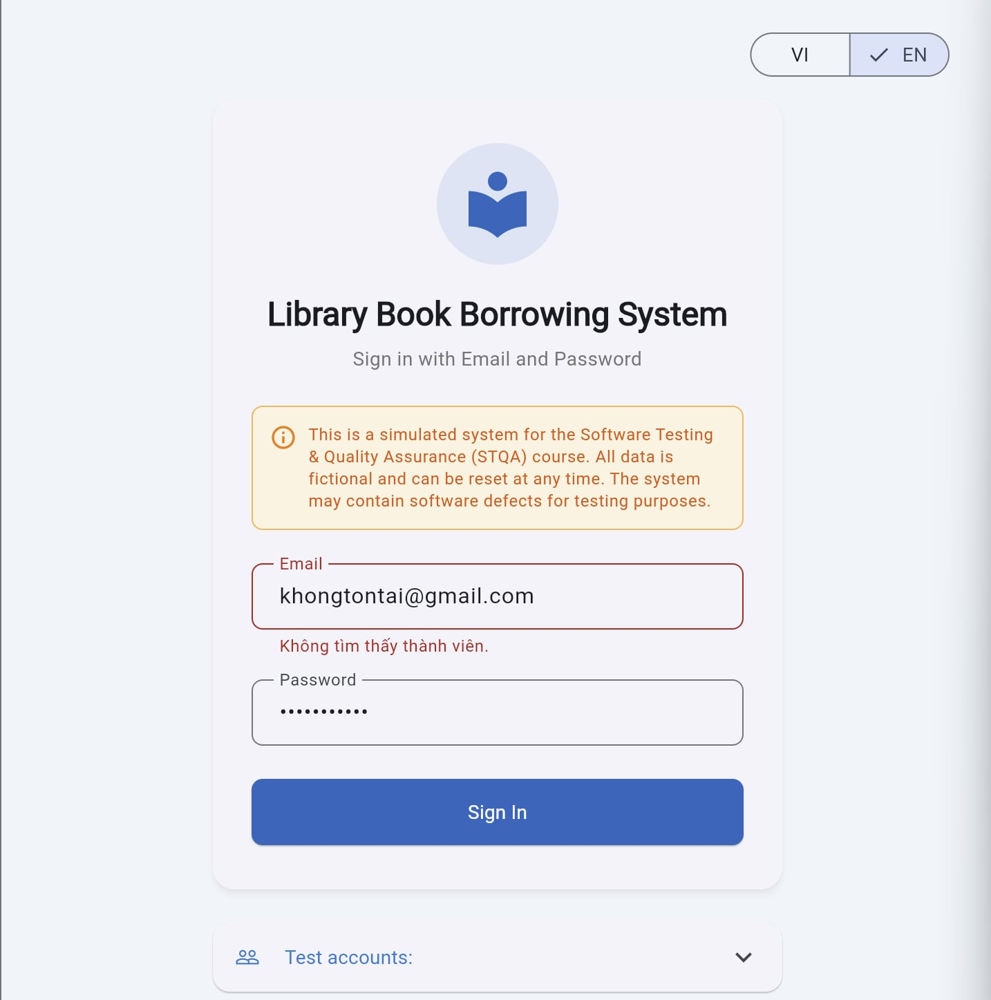
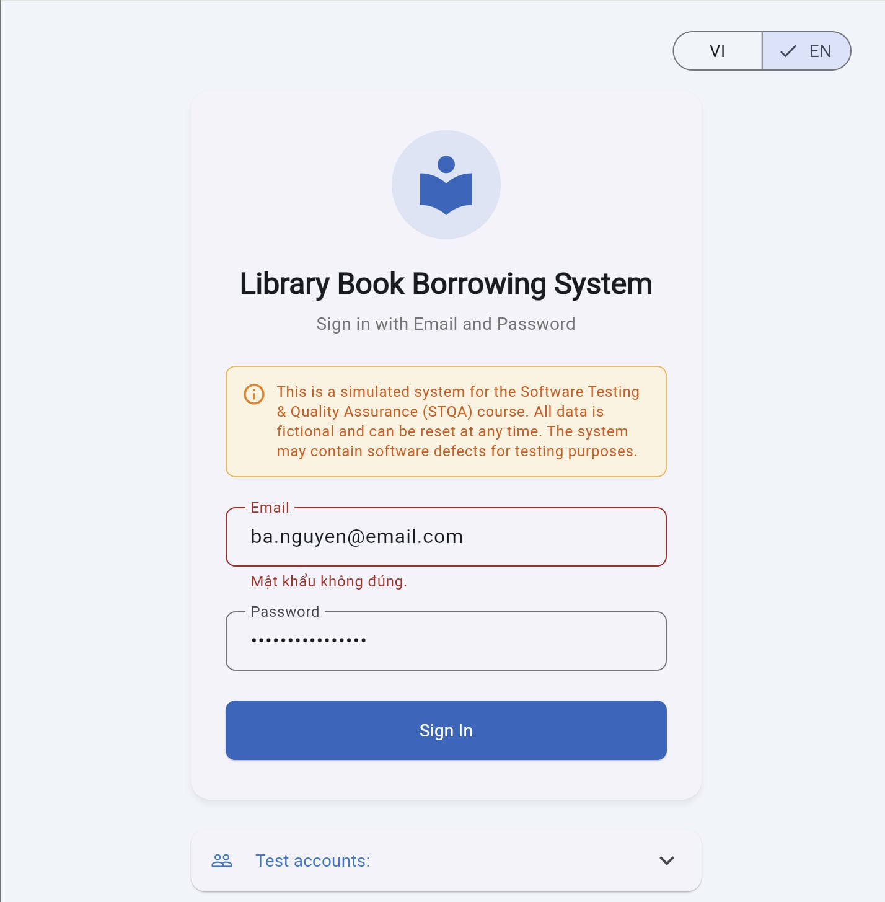
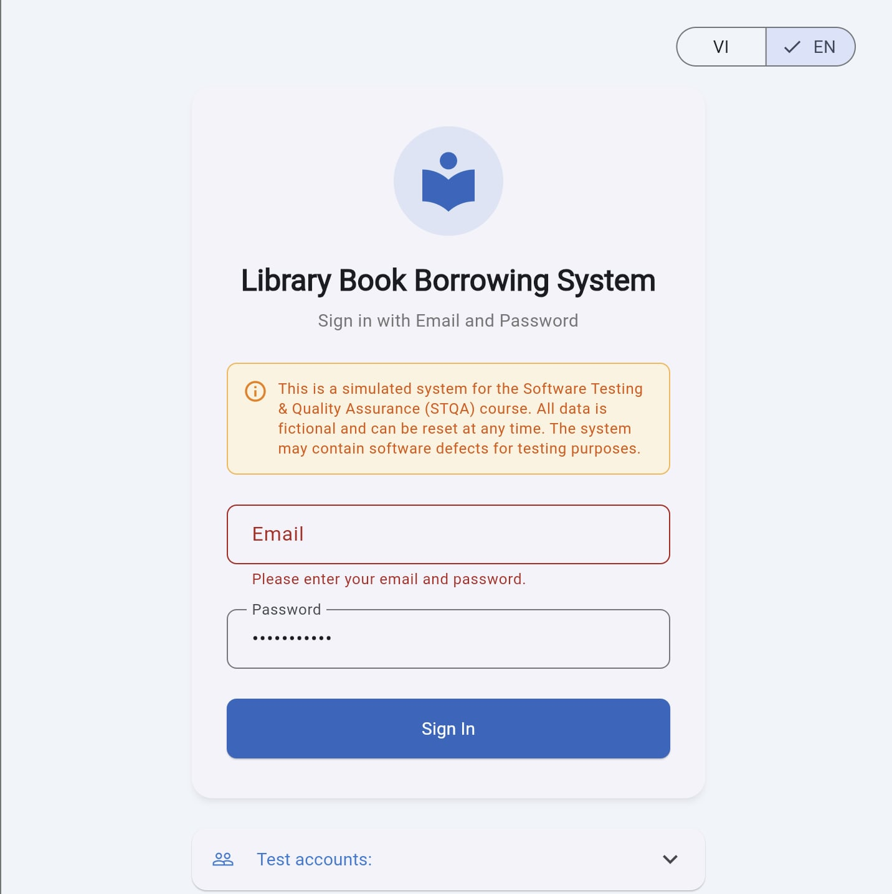
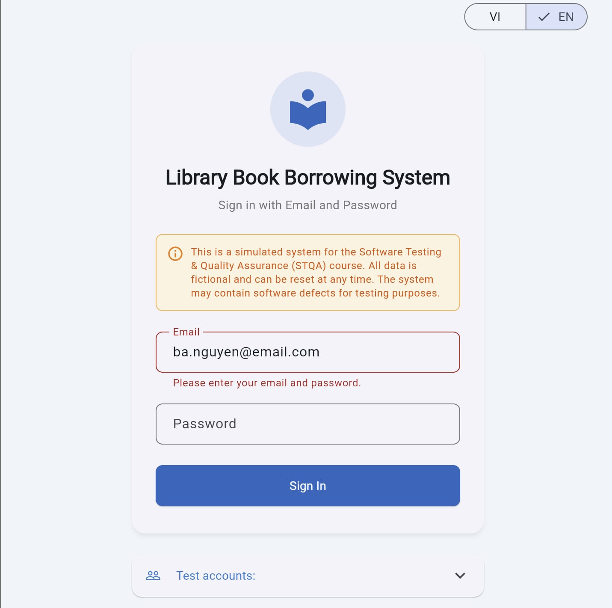
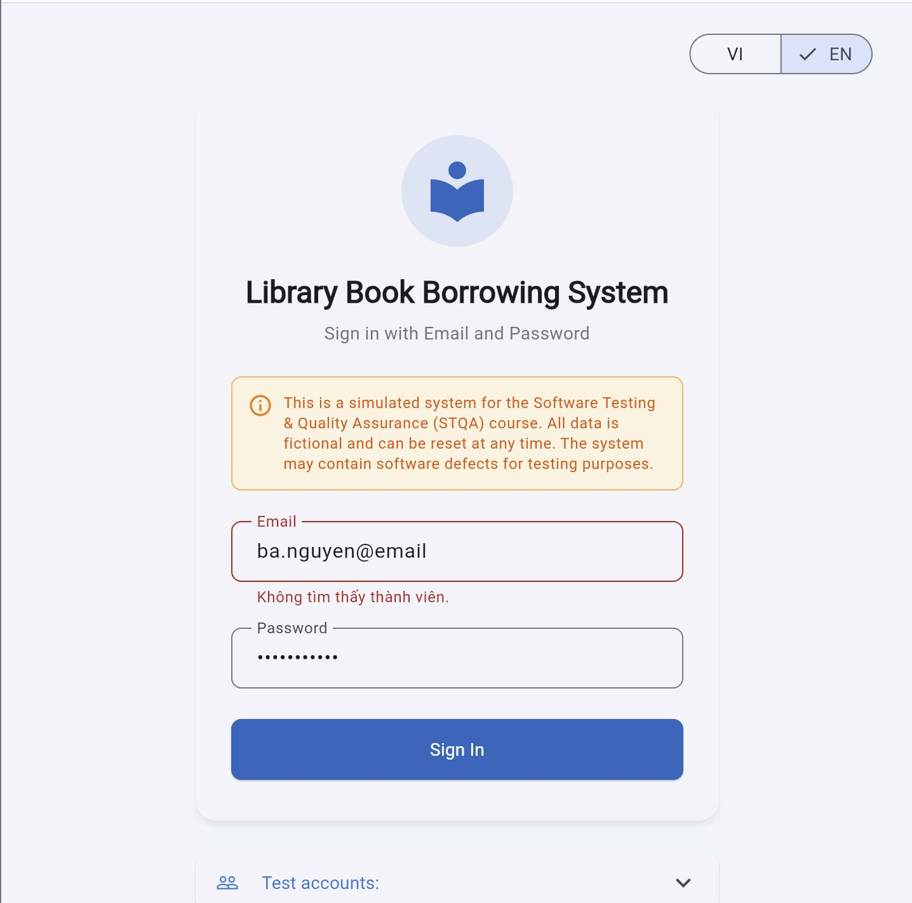

# Bug Reports


| Information | |
|---|---|
| **Group** | Group 14 |
| **Reporting date** | 28/05/2026 |

---

## Environment

- Browser: Chrome version 142, Chrome Version 148, Chrome
- Operating System: Windows 10, Linux, Windows 11
- Web application: Library Management System
- User Interface Language: Vietnamese, English

---

## BUG-01: Category filter returns no results when input is lowercase or uppercase

| Attribute | Details |
|-----------|---------|
| **Bug ID** | BUG-01 |
| **Related TC** | TC-03-06 |
| **Related REQ** | REQ-03 |
| **Severity** | Medium |
| **Reported by** | Nguyễn Minh Nhật |
| **Date reported** | 19/05/2026 |
| **Status** | Open |

**Preconditions:**
- Logged in as `ba.nguyen@email.com`
- On Books tab
- Data has been reset to seed data

**Steps to reproduce:**
1. Go to **Books** tab.
2. Click on the category filter bar.
3. Type `"công nghệ"` (all lowercase).
4. Observe the book list.
5. Clear the filter.
6. Type `"CÔNG NGHỆ"` (all uppercase)
7. Observe the book list.

**Expected result:**
Both inputs display 8 books in Technology category — same as typing `"Công nghệ"`. SRS REQ-03 states search must be case-insensitive.

**Actual result:**
Both inputs return "No books found". No books shown.

**Impact:**
- Users who type category names in lowercase or uppercase get no results despite matching books existing in the system.
- Violates the case-insensitive rule stated in SRS REQ-03. This is inconsistent with keyword search bar which correctly handles case-insensitive input.

**Severity explanation:** Medium

The category filter still works with exact casing. Core functionality is not broken, but the inconsistency with the keyword bar and the SRS violation reduce reliability and usability.

**Priority:**
P2

**Evidence:**
- Screenshot lowecase: .png)
- Screenshot uppercase: .png)

**Suggested fix:**
Apply `.toLowerCase()` or equivalent normalization to both the user input and the stored category values before comparison, consistent with how the keyword search bar already handles case. 

---

## BUG-02: Combined search does not apply AND logic — the last-entered search bar overrides the other, returning wrong results

| Attribute | Details |
|-----------|---------|
| **Bug ID** | BUG-02 |
| **Related TC** | TC-03-11, TC-03-12 |
| **Related REQ** | REQ-03 |
| **Severity** | High |
| **Reported by** | Nguyễn Minh Nhật |
| **Date reported** | 19/05/2026 |
| **Status** | Open |

**Preconditions:**
- Logged in as `ba.nguyen@email.com`
- On Books tab
- Data has been reset to seed data

**Steps to reproduce:**
- TC-03-11 — 1. keyword first
1. Go to **Books** tab.
2. Type `"Nguyễn Minh Đức"` in the title/author search bar.
3. Observe — display 2 books: BOOK001, BOOK009.
4. Type `"Công nghệ"` in the category filter.
5. Observe the book list.
- TC-03-11 — 2. category first
1. Go to **Books** tab.
2. Type `"Công nghệ"` in the category filter.
3. Observe — display 8 Technology books.
4. Type `"Nguyễn Minh Đức"` in the title/author search bar.
5. Observe the book list.
- TC-03-12 — 1. keyword first
1. Go to **Books** tab.
2. Type `"Nguyễn Minh Đức"` in the title/author search bar.
3. Observe — display 2 books: BOOK001, BOOK009.
4. Type `"Kinh tế"` in the category filter.
5. Observe the book list.
- TC-03-12 — 2. category first
1. Go to **Books** tab.
2. Type `"Kinh tế"` in the category filter.
3. Observe — display 3 Economics books: BOOK007, BOOK014, BOOK015.
4. Type `"Nguyễn Minh Đức"` in the title/author search bar.
5. Observe the book list.

**Expected result:**
- TC-03-11: Display exactly 2 books — BOOK001 (Lập trình Flutter cơ bản) and BOOK009 (Nhập môn lập trình Python), authored by Nguyễn Minh Đức AND in Technology category. Result must be identical regardless of input order.
- TC-03-12: Display "Không tìm thấy sách" — Nguyễn Minh Đức has no books in Economics category. Result must be identical regardless of input order.

**Actual result:**
- TC-03-11 - 1: Display 8 Technology books — category filter overrides keyword entirely.
- TC-03-11 - 2: Display 2 books BOOK001, BOOK009 — keyword overrides category (accidentally correct but inconsistent).
- TC-03-12 - 1: Display 3 Economics books: BOOK007, BOOK014, BOOK015 — category overrides keyword.
- TC-03-12 - 2: Display 2 books BOOK001, BOOK009 — keyword overrides category, ignores category filter

**Impact:**
- Combined search is fundamentally broken. Results are unpredictable and depend entirely on input order (based on which bar is entered last).
- Users cannot narrow down results using both filters simultaneously, which defeats the purpose of having two search bars. Wrong books are returned silently with no error message.

**Severity explanation:** High

Combined filtering is a core use case of REQ-03 (especially when users don't remember the exact the detail of name). The feature returns incorrect results in 3 out of 4 scenarios with no warning to the user. This directly misleads users and violates SRS requirements.

**Priority:**
P1

**Evidence:**
- Screenshot match - author 1st: .png) .png) .png)
- Screenshot match - genre 1st: .png)
- Screenshot mismatch author 1st: .png)
- Screenshot mismatch genre 1st: .png)

**Suggested fix:**
Refactor the search/filter logic to evaluate both conditions simultaneously using AND logic: a book must satisfy both the keyword condition (title or author contains keyword) and the category condition (category matches filter) to appear in results. The result must be consistent regardless of which bar is filled in first.

---

## BUG-03: Error message says the member has expired while they are suspended

| Attribute | Details |
|-----------|---------|
| **Bug ID** | BUG-03 |
| **Related TC** | TC-04-04 |
| **Related REQ** | REQ-04 |
| **Severity** | High |
| **Reported by** | Trần Thị Thu Trang |
| **Date reported** | 23/05/2026 |
| **Status** | Open |

**Preconditions:**
1. Member can log in
2. Member has been suspended
3. Book is available
4. Member's borrow count is less than 3

**Steps to reproduce:**
1. Refresh the page
2. Log in to the account of MEM004
3.  Borrow the book BOOK001

**Expected result:**
- Member cannot borrow the book
- Display error message: member has been suspended
- Program state remains unchanged

**Actual result:**
- Member cannot borrow the book
- Error message says the member has expired
- Program state remains unchanged

**Impact:**
- Wrong cause of error is announced to the user, leading to confusion

**Severity explanation:** High
- Mixing up between suspension and expiration violates the business rule.

**Priority:** P1

**Evidence:**
- Before borrowing BOOK001: /BOOK001_before.png)
- After borrowing BOOK001: /BOOK001_after_vi.png)
- Borrow records before borrowing: /BR_before.png)
- Borrow records after borrowing: /BR_after.png)

**Suggested fix:**
Correct the error message to "member has been suspended"

---

## BUG-04: Users can still borrow a book when their borrow count is 3

| Attribute | Details |
|-----------|---------|
| **Mã lỗi** | BUG-04 |
| **Related TC** | TC-04-06 |
| **Related REQ** | REQ-04 |
| **Severity** | High |
| **Reported by** | Trần Thị Thu Trang |
| **Date reported** | 23/05/2026 |
| **Status** | Open |

**Preconditions:**
1. Member can log in
2. Member is active
3. Book is available
4. Member's borrow count is 3

**Steps to reproduce:**
1. Refresh the page
2. Log in to the account of MEM002
3. Borrow the book BOOK001
4. Borrow the book BOOK002
5. Borrow the book BOOK005 

**Expected result:**
- Member cannot borrow the book BOOK005
- BOOK005 remains available
- Display error message when borrowing BOOK005 in corresponding display language: borrow limit reached
- Borrow records for that member and books BOOK001 and BOOK002 are created, due date is 14 days later after today, no record created for BOOK005

**Actual result:**
Member can borrow book BOOK005, no error message is displayed, borrow record for BOOK005 is created

**Impact:**
This violates the business requirement of only allowing to borrow up to 3 books at a time

**Severity explanation:** High
- Letting a member borrow more than 3 books violates the business rule

**Evidence:**
- Before borrowing BOOK005: 
- After borrowing BOOK005: 
- Borrow records before borrowing: 
- Borrow records after borrowing: 

**Suggested fix:**
Recheck the condition checking whether the user has reached the borrow limit.

---

## BUG-05: No overdue warning displayed when returning overdue books

| Attribute | Details |
|---|---|
| Bug ID | BUG-05 |
| Related TC | TC-05-02, TC-05-03 |
| Related REQ | REQ-05 |
| Severity | Medium |
| Reported by | Vũ Đức Quang |
| Date reported | 20/05/2026 |
| Status | Open |

**Preconditions:**
- A member is logged into the system.
- The member has an active borrow record.
- The selected borrow record satisfies:
  - `returnDate >= dueDate`
  - The book has not been returned yet.

**Steps to Reproduce:**
1. Log in using a member account.
2. Open the **Borrow / Return** page.
3. Select a borrow record where `returnDate >= dueDate`.
4. Click **Return Book**.
5. Observe the system response after the return action.

**Expected Result:**

The system should return the book successfully and display a clear overdue warning, because according to business rule **BR-05**:
> A book is considered overdue on the due date itself (including the exact due date).

Additionally:
- The book status should change to **"Available"**
- The borrow record status should change to **"Returned"**

**Actual Result:**
The system returned the book successfully:
- The book status changed to **"Available"**
- The borrow record status changed to **"Returned"**
However, **no overdue warning message was displayed** when `returnDate >= dueDate`.

**Impact:**
- This behavior violates business rules **BR-05 (Overdue)** and **BR-06 (Overdue Return Warning)**.
- Users do not receive an overdue warning even though the system defines books returned on the due date as overdue. This creates inconsistent behavior with the specified business requirements.

**Severity explanation:** Medium
- The defect does not block the return process or affect core system functionality.
- However, it violates business rules BR-05 and BR-06 by failing to display the required overdue warning.
- Users may misunderstand the overdue status of returned books.

**Evidence:**
- Before Return
.png)

- After Return
.png)
.png)

**Suggested fix:**
The system should display an overdue warning message when:

```text
returnDate >= dueDate
```
to ensure compliance with business rules **BR-05** and **BR-06**.

---

## BUG-06: Member can return books borrowed by another member

| Attribute | Details |
|---|---|
| Bug ID | BUG-06 |
| Related TC | TC-05-05 |
| Related REQ | REQ-05, REQ-08 |
| Severity | High |
| Reported by | Vũ Đức Quang, Nguyễn Hải Minh |
| Date reported | 27/05/2026 |
| Status | Open |

**Preconditions:**
- A member account is logged into the system.
- Another member has an active borrow record.
- The borrow record does not belong to the currently logged-in member.

**Steps to Reproduce:**
1. Log in using a member account (e.g. `dam.tran@email.com` / MEM003).
2. Open the **Borrow / Return** page.
3. Locate or select an active borrow record belonging to another member (e.g. MEM002).
4. Click **Return Book** on that borrow record.
5. Observe the system response and record status.

**Expected Result:**

The system must **not allow** a member to return another member’s borrowed book.

Additionally:
- Borrow records belonging to other members should **not be visible or accessible** for return actions.
- The **Return Book** button should not be displayed or should be disabled for unauthorized records.
- The borrow record status must remain unchanged.
- The book status must remain unchanged.

**Actual Result:**
The logged-in member was able to access and return a book borrowed by another member.

As a result:
- The borrow record status was updated even though the record did not belong to the current member.
- The book status changed despite unauthorized access.

**Impact:**

This behavior violates **access control and data ownership rules**.

Members are able to manipulate borrow records that belong to other users, which may lead to:
- Unauthorized modifications of borrowing history
- Incorrect book availability status
- Data integrity issues
- Privacy and security concerns

**Severity explanation:** High
- The defect allows unauthorized users to modify borrow records belonging to other members.
- This violates access control requirements and compromises data integrity.
- Unauthorized actions may affect borrowing history and book availability status.

**Evidence:**
Before Unauthorized Return

Logged in as **MEM003 (Trần Dựa Dẫm)**, but the system displayed borrow records belonging to **MEM002 (Nguyễn Học Bá)** and still allowed the **Return** action.
.png)

After Unauthorized Return

While logged in as **MEM003 (Trần Dựa Dẫm)**, the system successfully returned a borrow record belonging to **MEM002 (Nguyễn Học Bá)**. The record status changed to **Returned**, confirming unauthorized access and modification.
.png)

**Suggested fix:**

---

## BUG-07: System rejects valid email but accepts invalid email when creating a new member

| Attribute | Details |
|-----------|---------|
| **Bug ID** | BUG-07 |
| **Related TC** | TC-07-01 |
| **Related REQ** | REQ-07 |
| **Severity** | High |
| **Reported by** | Hoàng Hải Minh |
| **Date reported** | 12/5/2026 |
| **Status** | Open |

**Preconditions:**
Log in using librarian account (librarian@library.com / admin123)

**Steps to reproduce:**
1. Get in tab member
2. Navigate to the **Add New Member** page.
3. Enter valid member information, including a valid email format (e.g., `newmember@gmail.com`).
4. Click **Submit**.
5. Observe the system response.
6. Repeat the process using an invalid email format (e.g., `whoisthis@idontknow`).

**Expected result:**
New member successfully created, appears in list (REQ-07: valid input → created successfully)

**Actual result:**
Valid input --> Error message " Email invalid ", 
Invalid input --> Created succesfully

**Impact:**
Loss of new members, poor user experience, damage to reputation, allows invalid data to be stored in the system database.

**Severity explanation:** High

This bug prevents valid users from being created while still allowing invalid entries, which breaks core member registration flow and undermines data integrity.

**Evidence:**
.png)
.png)
.png)

**Suggested fix:**
Review and fix the email validation logic in the member creation form, ensure valid email formats are accepted and invalid formats are rejected correctly.

---

## BUG-08: Member can view other members' tickets (privacy breach)

| Attribute | Details |
|-----------|---------|
| **Bug ID** | BUG-08 |
| **Related TC** | TC-08-09 |
| **Related REQ** | REQ-08 |
| **Severity** | High |
| **Reported by** | Hoàng Hải Minh |
| **Date reported** | 12/5/2026 |
| **Status** | Open |

**Preconditions:**
Log in MEM002 (ba.nguyen) — another member is MEM003 (dam.tran) with BR002

**Steps to reproduce:**
1. Log in to MEM002
2. Go to the Borrow/Return tab
3. Enter/look up the ID of MEM003

**Expected result:**
Tickets for MEM003 are not displayed — or the search function by other IDs is unavailable (REQ-08: Tickets of other members cannot be viewed)

**Actual result:**
Tickets for MEM003 are displayed

**Impact:**
Data privacy breach

**Severity explanation:** High

The issue exposes other members' ticket data, creating a serious privacy breach and potential compliance violation.

**Evidence:**
.png)

**Suggested fix:**
Server-side / data-layer filtering, improve UI-layer enforcement

---

# Observation reports

## Environment

- Browser: Chrome Version 148, Chrome version 142
- Operating System: Windows 10, Linux
- Web application: Library Management System
- User Interface Language: Vietnamese, English

---

## OBSERVATION-01 Error message is displayed in Vietnamese instead of English when logging in with a non-existing email/incorrect password

| Attribute | Details |
|-----------|---------|
| **Report ID** | OBS-01 |
| **Related TC** | TC-01-03 ,TC-01-04|
| **Related REQ** | REQ-01 |
| **Type** | Failure - Requirement Gap |
| **Severity** | Low |
| **Reported by** | La Thi Bao Tram |
| **Date reported** | 25/05/2026 |
| **Status** | Open |

**Preconditions:**
- Application is running
- System language is set to English
- User is on the login screen

**Steps to reproduce:**
- TC-01-03:
1. Open the login page
2. Enter email: 'khongtontai@gmail.com'
3. Enter password: 'password123'
4. Click the **Login** button
- TC-01-04:
1. Open the login page
2. Enter email: 'ba.nguyen@email.com'
3. Enter password: 'wrongpassword123'
4. Click the **Login** button

**Expected result:**
- TC-01-03:System displays the error message:
'Member not found'(English Message)
- TC-01-04:System displays the error message:
'Incorrect password'(English Message)

**Actual result:**
- TC-01-03:System displays the Vietnamese message: 'Không tìm thấy thành viên'
- TC-01-04:System displays the Vietnamese message: 'Mật khẩu không đúng'

**Impact:**
English users may not understand the displayed error message, causing inconsistent user experience.

**Severity explanation:** Low

The issue does not prevent users from logging in or accessing system functions. However, it affects usability and language consistency when the application is used in English mode.

**Priority:**
- P2

**Evidence:**
- TC-01-03 screenshot: 
- TC-01-04 screenshot: 

**Suggested Fix:**
- Check localization configuration for error message keys
- Ensure “member not found” error uses English resource bundle when language = EN
- Verify fallback language logic is not defaulting to Vietnamese incorrectly

---

## OBSERVATION-02: The SRS specifies behavior only when both email and password fields are empty. However, the SRS does not define expected behavior for empty email only and empty password only

| Attribute | Details |
|-----------|---------|
| **Report ID** | OBS-02 |
| **Related TC** | TC-01-06 ,TC-01-07|
| **Related REQ** | REQ-01 |
| **Type** | Failure - Requirement Ambiguity |
| **Severity** | Low |
| **Reported by** | La Thi Bao Tram |
| **Date reported** | 25/05/2026 |
| **Status** | Open |

**Preconditions:**
- Application is running
- User is on the login screen

**Steps to reproduce:**
- TC-01-06:
1.Open the login page
2.Leave the email field empty
3.Enter password: 'password123'
4.Click the Login button
- TC-01-07:
1.Open the login page
2.Enter email: 'ba.nguyen@email.com'
3.Leave the password field empty
4.Click the Login button

**Expected result:**
- The SRS does not specify the expected behavior when only one field is empty.
=> Therefore, the expected result cannot be determined confidently.

**Actual result:**
- TC-01-06: System displays the message "Please enter your email and password"
- TC-01-07: System displays the message "Please enter your email and password"

**Impact:**
- Test verdict is marked as: Inconclusive. Because the specification is too vague to determine a Pass or Fail result.

**Severity explanation:** Low

The ambiguity does not prevent the system from functioning. However, it affects the ability to evaluate test results consistently and may lead to misunderstandings during development and testing.

**Priority:**
- P3

**Evidence:**
- TC-01-06 screenshot: 
- TC-01-07 screenshot: 

**Suggested Fix:**
- Expected validation message when email is empty
- Expected validation message when password is empty

---

## OBSERVATION-03: The SRS describes login functionality but does not specify behavior for invalid email format validation. Missing specifications include email without @ and email without . in domain

| Attribute | Details |
|-----------|---------|
| **Report ID** | OBS-03 |
| **Related TC** | TC-01-08 ,TC-01-09|
| **Related REQ** | REQ-01 |
| **Type** | Failure - Requirement Gap |
| **Severity** | Low |
| **Reported by** | La Thi Bao Tram |
| **Date reported** | 25/05/2026 |
| **Status** | Open |

**Preconditions:**
- Application is running
- User is on the login screen

**Steps to reproduce:**
- TC-01-08:
1. Open the login page
2. Enter email: user@gmail
3. Enter password: password123
4. Click Login
- TC-01-09:
1. Open the login page
2. Enter email: abc.com
3. Enter password: password123
4. Click Login

**Expected result:**
The SRS does not specify the expected behavior for invalid email formats
=> Therefore, the expected result cannot be determined

**Actual result:**
- TC-01-08: System displays the message "Member not found"
- TC-01-09: System displays the message "Member not found"

**Impact:**
The test verdict is marked as Inconclusive because the SRS does not define the expected behavior for invalid email formats.

**Risk:**
Different developers may implement inconsistent validation behavior.

**Severity explanation:** Low

The issue does not affect system operation directly. However, it prevents objective verification of login validation behavior and may lead to inconsistent implementations.

**Priority:**
- P3

**Evidence:**
- TC-01-08 screenshot: 
- TC-01-09 screenshot: 

**Suggested Fix:**
- Specify whether email format validation is required
- Define expected validation messages for invalid email formats
- Clarify whether format validation should occur before account lookup

---

## OBSERVATION-04: Both search bars do not support diacritic-insensitive input — typing without Vietnamese diacritics returns no results

| Attribute | Details |
|-----------|---------|
| **Bug ID** | OBS-04 |
| **Related TC** | TC-03-07 |
| **Related REQ** | REQ-03 |
| **Severity** | Low |
| **Type** | Failure - Requirement Gap |
| **Reported by** | Nguyễn Minh Nhật |
| **Date reported** | 20/05/2026 |
| **Status** | Open |

**Preconditions:**
- Logged in as `ba.nguyen@email.com`
- On Books tab
- Data has been reset to seed data

**Steps to reproduce:**
1. Go to **Books** tab.
2. Click on the title or author search bar.
3. Type `"Nguyen Minh Duc"` (without diacritics).
4. Observe the book list.
5. Clear the search bar.
6. Click on the category filter bar.
7. Type `"Cong nghe"` (without diacritics).
8. Observe the book list.

**Expected result:**
- Step 4: Display 2 books by Nguyễn Minh Đức — same result as TC-03-02.
- Step 8: Display 8 Technology books — same result as TC-03-03.

**Actual result:**
Display "No books found" for both steps. No books shown.

**Impact:**
- Users who type Vietnamese names or categories without diacritics get no results despite matching books existing in the system.
- Given that the system supports a Vietnamese-English language interface, this may affect a significant portion of users.

**Severity explanation:** Low

 SRS does not require diacritic-insensitive search. Current behavior is technically within spec. Reported as an observation for future consideration.

**Priority:**
P3

**Evidence:**
- Screenshot: .png)
- Screenshot: .png)

**Suggested fix:**
Implement diacritic normalization (e.g. convert `"Nguyen Minh Duc"` → `"Nguyễn Minh Đức"` before comparison) for both search bars. This is a common requirement for Vietnamese-language applications.

---

## OBSERVATION-05: Category filter does not support partial keyword input — requires full exact category name to return results

| Attribute | Details |
|-----------|---------|
| **Bug ID** | OBS-05 |
| **Related TC** | TC-03-09 |
| **Related REQ** | REQ-03 |
| **Severity** | Low |
| **Type** | Requirement Gap |
| **Reported by** | Nguyễn Minh Nhật |
| **Date reported** | 20/05/2026 |
| **Status** | Open |

**Preconditions:**
- Logged in as `ba.nguyen@email.com`
- On Books tab
- Data has been reset to seed data

**Steps to reproduce:**
1. Go to **Books** tab.
2. Click on the category filter bar.
3. Type `"Công"` (partial keyword).
4. Observe the book list.

**Expected result:**
Display 8 books whose category contains "Công": BOOK001, BOOK002, BOOK003, BOOK005, BOOK008, BOOK009, BOOK010, BOOK011.

**Actual result:**
Display "No books found". No books shown. Only typing the full exact name `"Công nghệ"` returns results.

**Impact:**
Category filter behaves inconsistently compared to the title/author search bar — which supports partial input. Users who type partial category names get no results and may assume no books exist in that category.

**Severity explanation:** Low

SRS does not explicitly require partial match for the category filter. However the inconsistency with the title/author bar creates a confusing user experience.

**Priority:**
P3

**Evidence:**
- Screenshot: 

**Suggested fix:**
Implement partial match logic for the category filter (e.g. use `.contains()` instead of exact match), consistent with how the title/author search bar handles input.

---

## OBSERVATION-06: Error messages are in Vietnamese while display language is English; Category bar search does not support English

| Attribute | Details |
|-----------|---------|
| **Bug ID** | OBS-06 |
| **Related TC** | TC-03-13; TC-04-04, TC-04-05, TC-04-07 |
| **Related REQ** | REQ-03, REQ-04 |
| **Type** | Failure - Requirement Gap |
| **Severity** | Low |
| **Reported by** | Trần Thị Thu Trang, Nguyễn Minh Nhật |
| **Date reported** | 23/05/2026 |
| **Status** | Open |

**Preconditions:**

**Steps to reproduce:**
- TC-03-13:
1. Go to **Books** tab.
2. Switch to English mode
3. Type `"Technology"`.
4. Observe the book list.

- TC-04-04, TC-04-05, TC-04-07:
1. Recreate the BUG-04-03, set display language to English after step 2
2. Perform TC-04-04:
	1. Refresh the page
	2. Log in to the account of MEM005
	3. Set display language to English
	4. Borrow the book BOOK001
3. Perform TC-04-06:
	1. Refresh the page
	2. Log in to the account of MEM002
	3. Set display language to English
	4. Borrow the book BOOK001
	5. Borrow the book BOOK002
	6. Borrow the book BOOK005
	7. Borrow the book BOOK008

**Expected result:**
- Display 8 books in Technology category
- Error messages are in English

**Actual result:**
- No books found
- Error messages are in Vietnamese

**Impact:**
- Users who do not know Vietnamese can be confused

**Severity explanation:** Low
- SRS does not require.
- It doesn't significantly affect the user experience.

**Evidence:**
- TC-04-04, TC-04-05, TC-04-07:
/BOOK001_after_en)
/BOOK001_after_en)
/BOOK008_after_en.png)

**Suggested fix:**
Correct the error messages to the English version when the display language is English

---
