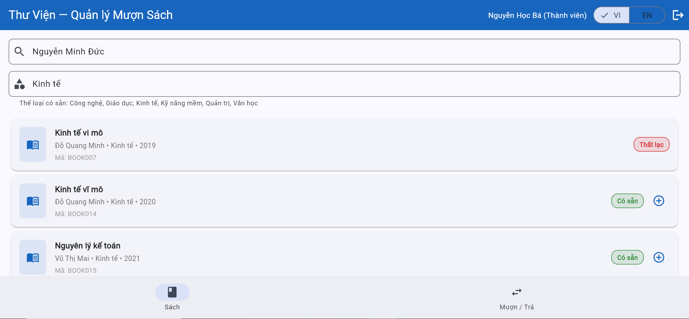
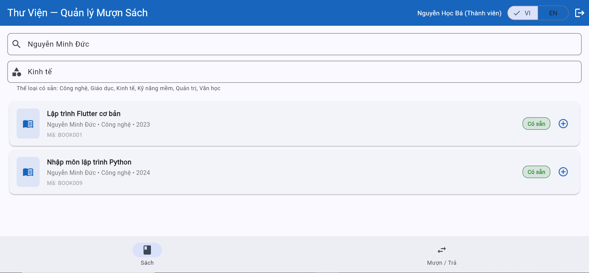

# Bug Reports — Báo cáo lỗi

> **Hướng dẫn**: Tạo 1 mục bug cho mỗi TC có kết quả **Fail**.
> Xem [examples/sample-bug-report.md](../examples/sample-bug-report.md) để hiểu cách viết bug report tốt.
> Mỗi bug cần: tiêu đề mô tả hành vi lỗi, bước tái hiện, expected vs actual, severity + giải thích.

| Thông tin | |
|---|---|
| **Nhóm** | Group 14 |
| **Ngày báo cáo** | 23/05/2026 |

---

## BUG-01

| Thuộc tính (Attribute) | Chi tiết (Detail) |
|-----------|---------|
| **Mã lỗi (Bug ID)** | BUG-01 |
| **TC liên quan (Related TC)** | TC-06 |
| **REQ liên quan (Related REQ)** | REQ-03 |
| **Mức độ (Severity)** | Medium |
| **Người phát hiện (Found by)** | Nguyễn Minh Nhật |
| **Ngày phát hiện (Date found)** | 20/05/2026 |
| **Trạng thái (Status)** | Open |

**Tiêu đề (Title):**
Category filter returns no results when input is lowercase or uppercase

**Môi trường (Environment):**
- Trình duyệt (Browser): Chrome `<!-- version 142.0.7444.176 -->`
- Hệ điều hành (OS): `<!-- Windows 10 -->`
- Web application: Library Management System
- Ngôn ngữ giao diện (UI language): English

**Điều kiện tiên quyết (Preconditions):**
- Logged in as `ba.nguyen@email.com`
- On Books tab
- Data has been reset to seed data

**Bước tái hiện (Steps to reproduce):**
1. Go to **Books** tab.
2. Click on the category filter bar.
3. Type `"công nghệ"` (all lowercase).
4. Observe the book list.
5. Clear the filter.
6. Type `"CÔNG NGHỆ"` (all uppercase)
7. Observe the book list.

**Kết quả mong đợi (Expected result):**
Both inputs display 8 books in Technology category — same as typing `"Công nghệ"`. SRS REQ-03 states search must be case-insensitive.

**Kết quả thực tế (Actual result):**
Both inputs return "No books found". No books shown.

**Tác động (Impact):**
Users who type category names in lowercase or uppercase get no results despite matching books existing in the system. Violates the case-insensitive rule stated in SRS REQ-03. This is inconsistent with keyword search bar which correctly handles case-insensitive input (verified in TC-05).

**Severity explanation:**
Medium - the category filter still works with exact casing. Core functionality is not broken, but the inconsistency with the keyword bar and the SRS violation reduce reliability and usability.

**Priority:**
P2

**Minh chứng (Evidence):**
- Screenshot lowecase: 
- Screenshot uppercase: 

**Đề xuất xử lý (Suggested fix):**
Apply `.toLowerCase()` or equivalent normalization to both the user input and the stored category values before comparison, consistent with how the keyword search bar already handles case. 

---

## BUG-02

| Thuộc tính (Attribute) | Chi tiết (Detail) |
|-----------|---------|
| **Mã lỗi (Bug ID)** | BUG-02 |
| **TC liên quan (Related TC)** | TC-09 |
| **REQ liên quan (Related REQ)** | REQ-03 |
| **Mức độ (Severity)** | Low |
| **Người phát hiện (Found by)** | Nguyễn Minh Nhật |
| **Ngày phát hiện (Date found)** | 20/05/2026 |
| **Trạng thái (Status)** | Open |

**Tiêu đề (Title):**
Category filter does not support partial keyword input — requires full exact category name to return results

**Môi trường (Environment):**
- Trình duyệt (Browser): Chrome `<!-- version 142.0.7444.176 -->`
- Hệ điều hành (OS): `<!-- Windows 10 -->`
- Web application: Library Management System
- Ngôn ngữ giao diện (UI language): English

**Điều kiện tiên quyết (Preconditions):**
- Logged in as `ba.nguyen@email.com`
- On Books tab
- Data has been reset to seed data

**Bước tái hiện (Steps to reproduce):**
1. Go to **Books** tab.
2. Click on the category filter bar.
3. Type `"Công"` (partial keyword).
4. Observe the book list.

**Kết quả mong đợi (Expected result):**
Display 8 books whose category contains "Công": BOOK001, BOOK002, BOOK003, BOOK005, BOOK008, BOOK009, BOOK010, BOOK011.

**Kết quả thực tế (Actual result):**
Display "No books found". No books shown. Only typing the full exact name `"Công nghệ"` returns results.

**Tác động (Impact):**
Category filter behaves inconsistently compared to the title/author search bar — which supports partial input (verified in TC-08). Users who type partial category names get no results and may assume no books exist in that category.

**Severity explanation:**
Low — SRS does not explicitly require partial match for the category filter. However the inconsistency with the title/author bar creates a confusing user experience.

**Priority:**
P3

**Minh chứng (Evidence):**
- Screenshot: 

**Đề xuất xử lý (Suggested fix):**
Implement partial match logic for the category filter (e.g. use `.contains()` instead of exact match), consistent with how the title/author search bar handles input.

--

## BUG-03

| Thuộc tính (Attribute) | Chi tiết (Detail) |
|-----------|---------|
| **Mã lỗi (Bug ID)** | BUG-03 |
| **TC liên quan (Related TC)** | TC-11, TC-12 |
| **REQ liên quan (Related REQ)** | REQ-03 |
| **Mức độ (Severity)** | High |
| **Người phát hiện (Found by)** | Nguyễn Minh Nhật |
| **Ngày phát hiện (Date found)** | 20/05/2026 |
| **Trạng thái (Status)** | Open |

**Tiêu đề (Title):**
Combined search does not apply AND logic — the last-entered search bar overrides the other, returning wrong results

**Môi trường (Environment):**
- Trình duyệt (Browser): Chrome `<!-- version 142.0.7444.176 -->`
- Hệ điều hành (OS): `<!-- Windows 10 -->`
- Web application: Library Management System
- Ngôn ngữ giao diện (UI language): English

**Điều kiện tiên quyết (Preconditions):**
- Logged in as `ba.nguyen@email.com`
- On Books tab
- Data has been reset to seed data

**Bước tái hiện (Steps to reproduce):**
- TC-11 — 1. keyword first
1. Go to **Books** tab.
2. Type `"Nguyễn Minh Đức"` in the title/author search bar.
3. Observe — display 2 books: BOOK001, BOOK009.
4. Type `"Công nghệ"` in the category filter.
5. Observe the book list.
- TC-11 — 2. category first
1. Go to **Books** tab.
2. Type `"Công nghệ"` in the category filter.
3. Observe — display 8 Technology books.
4. Type `"Nguyễn Minh Đức"` in the title/author search bar.
5. Observe the book list.
- TC-12 — 1. keyword first
1. Go to **Books** tab.
2. Type `"Nguyễn Minh Đức"` in the title/author search bar.
3. Observe — display 2 books: BOOK001, BOOK009.
4. Type `"Kinh tế"` in the category filter.
5. Observe the book list.
- TC-12 — 2. category first
1. Go to **Books** tab.
2. Type `"Kinh tế"` in the category filter.
3. Observe — display 3 Economics books: BOOK007, BOOK014, BOOK015.
4. Type `"Nguyễn Minh Đức"` in the title/author search bar.
5. Observe the book list.

**Kết quả mong đợi (Expected result):**
- TC-11: Display exactly 2 books — BOOK001 (Lập trình Flutter cơ bản) and BOOK009 (Nhập môn lập trình Python), authored by Nguyễn Minh Đức AND in Technology category. Result must be identical regardless of input order.
- TC-12: Display "Không tìm thấy sách" — Nguyễn Minh Đức has no books in Economics category. Result must be identical regardless of input order.

**Kết quả thực tế (Actual result):**
- TC-11 - 1: Display 8 Technology books — category filter overrides keyword entirely.
- TC-11 - 2: Display 2 books BOOK001, BOOK009 — keyword overrides category (accidentally correct but inconsistent).
- TC-12 - 1: Display 3 Economics books: BOOK007, BOOK014, BOOK015 — category overrides keyword.
- TC-12 - 2: Display 2 books BOOK001, BOOK009 — keyword overrides category, ignores category filter

**Tác động (Impact):**
Combined search is fundamentally broken. Results are unpredictable and depend entirely on input order (based on which bar is entered last). Users cannot narrow down results using both filters simultaneously, which defeats the purpose of having two search bars. Wrong books are returned silently with no error message.

**Severity explanation:**
High — combined filtering is a core use case of REQ-03 (especially when users don't remember the exact the detail of name). The feature returns incorrect results in 3 out of 4 scenarios with no warning to the user. This directly misleads users and violates SRS requirements.

**Priority:**
P1

**Minh chứng (Evidence):**
Match
- Screenshot match - author 1st:   
- Screenshot match - genre 1st: 
- Screenshot mismatch author 1st: 
- Screenshot mismatch genre 1st: 

**Đề xuất xử lý (Suggested fix):**
Refactor the search/filter logic to evaluate both conditions simultaneously using AND logic: a book must satisfy both the keyword condition (title or author contains keyword) AND the category condition (category matches filter) to appear in results. The result must be consistent regardless of which bar is filled in first.

---

<!-- Copy template BUG trên để thêm BUG-03, BUG-04, ... cho mỗi TC Fail -->
