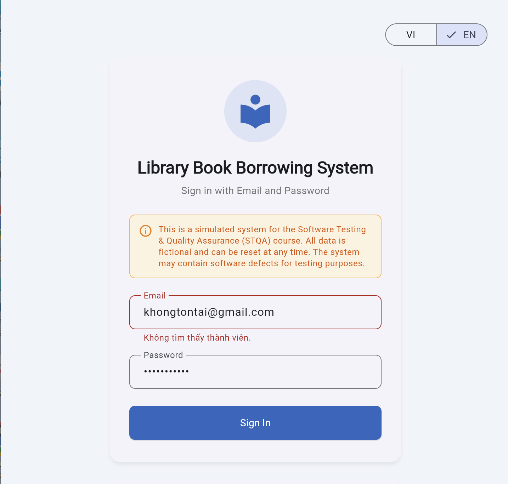
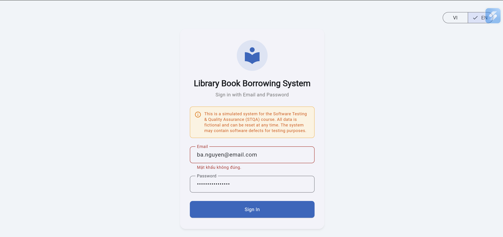

# Test Observation Report

| Attribute | Details |
|-----------|---------|
| **Report ID** | OBS-01 |
| **Related TC** | TC-03 ,TC-04|
| **Related REQ** | REQ-01 |
| **Type** | Failure |
| **Severity** | Low |
| **Reported By** | La Thi Bao Tram |
| **Date Reported** | 25/05/2026 |
| **Status** | Open |

## Title
- TC-03: Error message is displayed in Vietnamese instead of English when logging in with a non-existing email
- TC-04: Error message is displayed in Vietnamese instead of English when logging in with incorrect password
## Environment
- Browser: Chrome Version 148
- Operating System: Windows 10
- Application: Library Management System
- UI Language: English

## Preconditions
- Application is running
- System language is set to English
- User is on the login screen

## Steps to Reproduce
- TC-03:
1. Open the login page
2. Enter email: 'khongtontai@gmail.com'
3. Enter password: 'password123'
4. Click the **Login** button
- TC-04:
1. Open the login page
2. Enter email: 'ba.nguyen@email.com'
3. Enter password: 'wrongpassword123'
4. Click the **Login** button

## Expected Result
- TC03:System displays the error message:
'Member not found'(English Message)
- TC04:System displays the error message:
'Incorrect password'(English Message)

## Actual Result
- TC-03:System displays the Vietnamese message:
'Không tìm thấy thành viên'
- TC-04:System displays the Vietnamese message:
'Mật khẩu không đúng'

## Impact
English users may not understand the displayed error message, causing inconsistent user experience.

## Priority
- P2
## Evidence
## Evidence

<strong>TC-03 Screenshot</strong>

  

<strong>TC-04 Screenshot</strong>

## Suggested Fix
- Check localization configuration for error message keys
- Ensure “member not found” error uses English resource bundle when language = EN
- Verify fallback language logic is not defaulting to Vietnamese incorrectly

# Requirement Ambiguity report -RA-01
| Attribute | Details |
|-----------|---------|
| **Report ID** | RA-01 |
| **Related TC** | TC-06 ,TC-07|
| **Related REQ** | REQ-01 |
| **Type** | Requirement Ambiguity |
| **Severity** | Low |
| **Reported By** | La Thi Bao Tram |
| **Date Reported** | 25/05/2026 |
| **Status** | Open |
## Title
The SRS specifies behavior only when BOTH email and password fields are empty.
However, the SRS does not define expected behavior for:
- empty email only
- empty password only

Therefore, expected results cannot be determined confidently.

## Environment
- Browser: Chrome Version 148
- Operating System: Windows 10
- Application: Library Management System
- UI Language: English

## Testing Impact
- Test verdict is marked as: Inconclusive. Because the specification is too vague to determine Pass/Fail.

## Suggested Fix
- Expected validation message when email is empty
- Expected validation message when password is empty

# Requirement Gap report -RA-01
| Attribute | Details |
|-----------|---------|
| **Report ID** | RG-01 |
| **Related TC** | TC-08 ,TC-09|
| **Related REQ** | REQ-01 |
| **Type** | Requirement Gap |
| **Severity** | Low |
| **Reported By** | La Thi Bao Tram |
| **Date Reported** | 25/05/2026 |
| **Status** | Open |

## Title
The SRS describes login functionality but does not specify behavior for invalid email format validation.
Missing specifications include:
- email without @
- email without . in domain

## Environment
- Browser: Chrome Version 148
- Operating System: Windows 10
- Application: Library Management System
- UI Language: English

## Testing Impact
Expected behavior cannot be determined from the SRS.
Test verdict is marked as: Inconclusive

## Risk
- Different developers may implement inconsistent validation behavior.

## Suggested Fix
- whether email format validation is required
- expected validation messages for invalid email formats
- whether format validation occurs before account lookup

