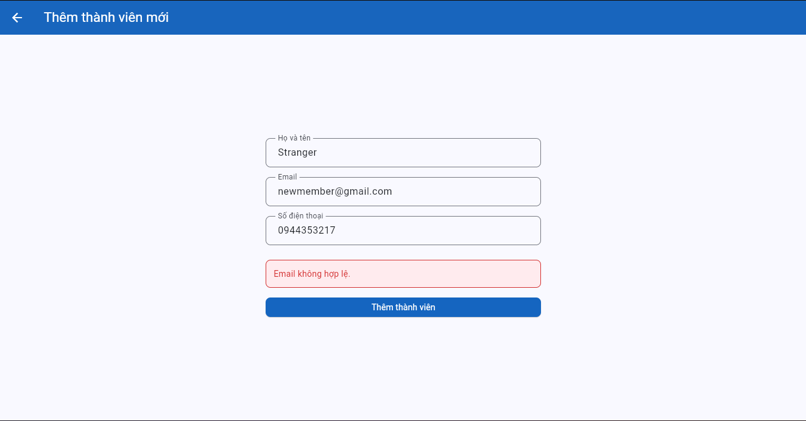
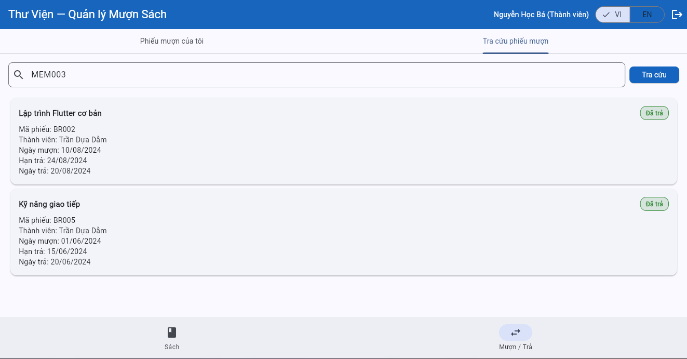

# Bug Reports — Báo cáo lỗi

> **Hướng dẫn**: Tạo 1 mục bug cho mỗi TC có kết quả **Fail**.
> Xem [examples/sample-bug-report.md](../examples/sample-bug-report.md) để hiểu cách viết bug report tốt.
> Mỗi bug cần: tiêu đề mô tả hành vi lỗi, bước tái hiện, expected vs actual, severity + giải thích.
## BUG-07

| Thuộc tính | Chi tiết |
|-----------|---------|
| **Mã lỗi** | BUG-07 |
| **TC liên quan** | TC-01 |
| **REQ liên quan** | REQ-07 |
| **Mức độ** | High |
| **Người phát hiện** | Hoàng Hải Minh |
| **Ngày phát hiện** | 12/5/2026 |
| **Trạng thái** | Open |

**Tiêu đề:**
No more new member — hệ thống từ chối email hợp lệ

**Môi trường:**
- Trình duyệt: Chrome
- Hệ điều hành: Windows 10
- Ngôn ngữ giao diện: English

**Điều kiện tiên quyết:**
Đăng nhập bằng librarian (librarian@library.com / admin123)

**Bước tái hiện:**
1. Get in tab member
2. Click “Add member”
3. Fill in information
4. Accept

**Kết quả mong đợi:**
New member successfully created, appears in list (REQ-07: valid input → created successfully)

**Kết quả thực tế:**
"Email invalid"

**Tác động:**
Loss of new members, poor user experience, damage to reputation, operational problem

**Minh chứng:**
- 

**Đề xuất xử lý:**
Check the registration form, inspect the database, review server log, fix backend code, improve server capacity

---

## BUG-08

| Thuộc tính | Chi tiết |
|-----------|---------|
| **Mã lỗi** | BUG-08 |
| **TC liên quan** | TC-09 |
| **REQ liên quan** | REQ-08 |
| **Mức độ** | High |
| **Người phát hiện** | Hoàng Hải Minh |
| **Ngày phát hiện** | 12/5/2026 |
| **Trạng thái** | Open |

**Tiêu đề:**
Member can view other members' tickets (privacy breach)

**Môi trường:**
- Trình duyệt: Chrome
- Hệ điều hành: Windows 10
- Ngôn ngữ giao diện: English

**Điều kiện tiên quyết:**
Log in MEM002 (ba.nguyen) — another member is MEM003 (dam.tran) with BR002

**Bước tái hiện:**
1. Log in to MEM002
2. Go to the Borrow/Return tab
3. Enter/look up the ID of MEM003

**Kết quả mong đợi:**
Tickets for MEM003 are not displayed — or the search function by other IDs is unavailable (REQ-08: Tickets of other members cannot be viewed)

**Kết quả thực tế:**
Tickets for MEM003 are displayed

**Tác động:**
Data privacy breach

**Minh chứng:**
- 

**Đề xuất xử lý:**
Server-side / data-layer filtering, improve UI-layer enforcement
