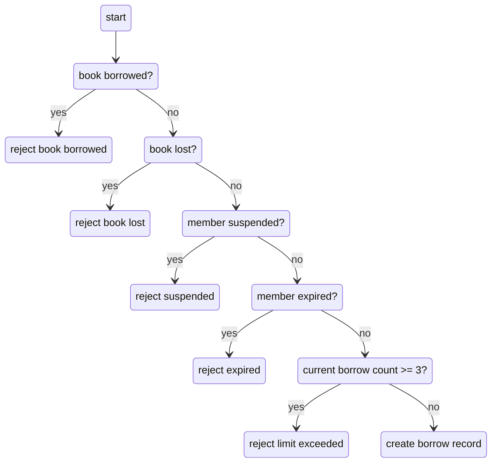

# Test Cases — Bảng trường hợp kiểm thử

> **Hướng dẫn**: Viết tối thiểu **20 TC** phủ đủ các chức năng chính (REQ-01 → REQ-08).
> Xem [examples/sample-test-case.md](../examples/sample-test-case.md) để hiểu cách viết TC tốt.
> Tự tổ chức và phân nhóm test case theo cách hợp lý nhất.

| Thông tin | |
|---|---|
| **Nhóm** | Group 14 |
| **Ngày tạo** | 19/05/2026 |
| **Hệ thống** | https://stqa.rbc.vn |
| **Tham chiếu** | SRS v1.0 |

---

## Bước 1: Mô hình hóa miền đầu vào — Input Domain Modeling (IDM)

> 📖 **Textbook:** Chương 6 — *Input Domain Modeling*, Paul Ammann & Jeff Offutt.
>
> **Trước khi viết Test Case**, nhóm **phải** phân tích miền đầu vào bằng bảng IDM bên dưới.
> Mỗi chức năng cần xác định: **Đặc tính (Characteristic)**, **Phân vùng (Block/Partition)**, và **Giá trị đại diện (Value)**.

### IDM — Đăng nhập (REQ-01)

| Đặc tính (Characteristic) | Phân vùng (Block) | Giá trị đại diện (Value) | Kết quả mong đợi |
|---|---|---|---|
| Existing Email | Valid librarian account | librarian@library.com | Login successful |
|  | Valid member account | ba.nguyen@email.com | Login successful |
|  | Non-existing email | khongtontai@gmail.com | Display message: “Member not found” |
| Password | Correct password | admin123 | User can log in successfully |
|  | Incorrect password | wrongpassword123 | Display message: “Incorrect password” |
| Input Fields | Both fields filled | Valid email + valid password | Continue login process |
|  | Both fields empty | Email: ""   Password: "" | Display message: “Please enter email and password” |
| Validation Behavior | Empty email only | Email: ""   Password: password123 |Display message: "Please enter email" |
|  | Empty password only | Email: ba.nguyen@email.com   Password: "" |Display message: "Please enter password" |
| Email Format  | Valid email format | ba.nguyen@email.com | Continue login validation |
| |Invalid email format(missing . in the format)|user@gmail| Display message: "Member not found"
| |Invalid email format(missing @ in the format)|abc.com| Display message: "Member not found "

### IDM - View Book List (REQ-02)

| Đặc tính (Characteristic) | Phân vùng (Block) | Giá trị đại diện (Value) | Kết quả mong đợi |
|---|---|---|---|
| User Role | Librarian | librarian@library.com | System displays complete book list |
|  | Member | ba.nguyen@email.com | System displays complete book list |
| Book Information Display (prone to change) | Complete book information | BOOK001 | System displays title, author, genre, published year correctly |
| Book Status | Available | BOOK001 | Status displayed as “Available” |
|  | Borrowed | BOOK003 | Status displayed as “Borrowed” |
|  | Lost | BOOK007 | Status displayed as “Lost” |
| Real-time Update | After borrowing a book | BOOK001 | Status changes immediately to “Borrowed” |
|  | After returning a book | BOOK003 | Status changes immediately to “Available” |

### IDM — Tìm kiếm sách (REQ-03)

| Đặc tính (Characteristic) | Phân vùng (Block) | Giá trị đại diện (Value) | Kết quả mong đợi |
|---|---|---|---|
| Keywords exists in DB | Yes (book title) | `"Flutter"` | Display books containing "Flutter" |
| | Yes (author name) | `"Nguyễn Minh Đức"` | Display books by Nguyễn Minh Đức |
| | Books (category) | `"Công nghệ"` | Display 8 books in Technology category only |
| | No match | `"XYZ123"` | Display "Không tìm thấy sách" |
| | Completely empty search | no input | Display all 20 books |
| Case sensitivity | Mixed case - keyword bar | `"Nguyễn Minh Đức"` | Display correct result (baseline) |
| | category bar | `"Công nghệ"` | Display correct result (baseline) |
| | Lowercase - keyword bar | `"nguyễn minh đức"` | Same result as "Flutter" |
| | category bar | `"công nghệ"` | Same result as "Công nghệ" |
| | Uppercase - keyword bar| `"NGUYỄN MINH ĐỨC"` | Same result as "Flutter" |
| | category bar | `"CÔNG NGHỆ"` | Same result as "Công nghệ" |
| Diacritic sensitivity | No diacritics - keyword bar | `"Nguyen Minh Duc"` | Show all books by author matching "Nguyen Minh Duc" (SRS does not require) |
| | category bar | `"Cong nghe"` | Show all books with genre matching "Cong nghe" (SRS does not require) |
| Partial keyword | Partial input - keyword bar | `"Nguyễn"` | Display all books whose author contains "Nguyễn" (SRS does not specify) |
| | category bar | `"Công"` | Display all books whose genre contains "Công" (SRS does not specify) |
| Keyword + category combined | Both match | `"Nguyễn Minh Đức"` + `"Công nghệ"` | Display 2 books: BOOK008, BOOK011 |
| | Keyword and category mismatch| `"Nguyễn Minh Đức"` + `"Kinh tế"` | Display "No books found" |

### IDM — Mượn sách (REQ-04)

| Đặc tính (Characteristic) | Phân vùng (Block) | Giá trị đại diện (Value) | Kết quả mong đợi |
|---|---|---|---|
| Trạng thái sách? | Có sẵn | BOOK001 | Cho phép mượn |
| | Đang mượn | BOOK003 | Không cho phép |
| | Thất lạc | BOOK007 | Không cho phép |
| Trạng thái thành viên? | Hoạt động | MEM002 | Cho phép mượn |
| | Tạm ngưng | MEM004 | Từ chối, thông báo lỗi |
| | Hết hạn | MEM005 | Từ chối, thông báo lỗi |
| Số sách đang mượn? | < 3 (BVA: 0, 1, 2) | MEM002 (1 sách) | Cho phép mượn |
| | = 3 (BVA: giới hạn) | MEM đã mượn 3 sách | Từ chối, thông báo vượt giới hạn |
| | > 3 | MEM has borrowed more than 3 books | Deny, announce limit exceeded |

### BELOW IDMs ARE STILL PRONE TO CHANGE

### IDM — Return Book (REQ-05)

| Đặc tính (Characteristic) | Phân vùng (Block) | Giá trị đại diện (Value) | Kết quả mong đợi |
|---|---|---|---|
| Borrow record status | Borrowing (active) | `BR001` | Allow return process |
| | Returned | `BR002` | Return action is not allowed |
| Due date compared to current date | `currentDate < dueDate` | `10/06 < 15/06` | Return successfully without overdue warning |
| | `currentDate = dueDate` (Boundary) | `15/06 = 15/06` | Return successfully and display overdue warning |
| | `currentDate > dueDate` | `20/06 > 15/06` | Return successfully and display overdue warning |
| Book status after return (not necessary) | Successful return | `BOOK001` | Book status changes to **"Available"** |
| Borrow record update (not necessary) | Successful return | `RECORD001` | Record status changes to **"Returned"** |
| Suggestion: add a characteristic "record owner" | Suggestion: add equivalence class "Records belong to MEM002" | BR001 of MEM002 | Can return the book |
|| Suggestion: add equivalence class "Records not belong to MEM002" | BR003 of MEM006 | Cannot return the book |

### IDM — Overdue Handling (REQ-06)

| Đặc tính (Characteristic) | Phân vùng (Block) | Giá trị đại diện (Value) | Kết quả mong đợi |
|---|---|---|---|
| User role | Librarian | `librarian@library.com` | Can access **Check Overdue** function |
| | Member | `ba.nguyen@email.com` | Cannot access function |
| Due date compared to current date | `dueDate > currentDate` | `20/06 > 15/06` | Record is **not marked overdue** |
| | `dueDate = currentDate` (Boundary) | `15/06 = 15/06` | Record is marked **"Overdue"** |
| | `dueDate < currentDate` | `10/06 < 15/06` | Record is marked **"Overdue"** |
| Borrow record status | Borrowing | `Borrowing` | Eligible for overdue checking |
| | Returned | `Returned` | Not marked overdue / ignored |

### IDM — Members (REQ-07)

| Đặc tính (Characteristic) | Phân vùng (Block) | Giá trị đại diện (Value) | Kết quả mong đợi |
|---|---|---|---|
| Full name | Valid | "Kevin Hart" | Accept |
| | Only whitespaces | "   " (3 spaces) | Deny, display "Please enter your username" |
| | Blank | (blank) | Deny, display "Please enter your username" |
| Email | Valid | member@so.com | Accept |
| | Missing @ or missing . | memberso.com or member@socom | Deny, display "Please enter your email" |
| | Blank | (blank) | Deny, display "Please enter your email" |
| Phone number (missing "does not start with 0, 10 digits" and "does not start with 0, not 10 digits") | Starts with 0, 10 digits | 0988743321 | Accept |
| | Starts with 0, not 10 digits | 09283189 | Deny, display "Please enter your phone number" |
| | Contains letters | abcxyz | Deny, display "Please enter your phone number" |
| Ability to add member | Admin | librarian@library.com | Allow |
| | Member | ba.nguyen@email.com | Deny |

### IDM — Search borrow tickets (REQ-08)

| Đặc tính (Characteristic) | Phân vùng (Block) | Giá trị đại diện (Value) | Kết quả mong đợi |
|---|---|---|---|
| Role | Librarian | librarian@library.com | Display all tickets |
| Suggestion | Active member | ba.nguyen@email.com (MEM002) | Only display ticket of MEM002 |
|  | Suspended member | cu.le@email.com (MEM004) | Only display ticket of MEM004 |
| Search member ID | Librarian tìm MEM002/MEM003/MEM006 | MEM002, MEM003, MEM006 | Hiển thị tất cả ticket tương ứng |
|  | Member tìm chính họ | MEM002 tìm MEM002 | Hiển thị lịch sử mượn của MEM002 |
|  | Member tìm người khác | MEM002 tìm MEM003 | Không hiển thị ticket, thông báo "Not found" |
|  | ID không tồn tại | MEM099 | Thông báo "Not exist" hoặc "Not found" |
| Borrow record ID | ID tồn tại - Borrowed | BR001 | Hiển thị trạng thái tương ứng |
|  | ID tồn tại - Returned | BR002 | Hiển thị thông báo "Returned" |
|  | ID tồn tại - Expired | BR001 (sau check overdue) | Hiển thị thông báo "Expired" |
|  | ID không tồn tại | BR369 | Thông báo "Not found" |
| Borrow history | Có lịch sử | MEM002 có BR001, BR004 | Hiển thị lịch sử mượn |
| Borrow history | Chưa mượn | New member | Danh sách rỗng |

### Explanation of Techniques Used:
**1. Equivalence Partition (EP):**

We use mathematical notions to construct our IDM: partitions and equivalence classes.

For each input, we define characteristics for it. These characteristics are defined such that they are partitions of the input set: that is, they are complete and disjoint.
Within a characteristic, we define equivalence classes, which are also known as blocks. As its name suggests, an equivalence class contains elements which are equivalent to each other. This means that we can pick whatever element (a representative value) in a class and the outcome of the test should still be the same, because they are all equivalent.

We use EP because with EP, we do not need to test all possible inputs in the input space while still retaining the effectiveness of tests.

**2. Boundary Value Analysis (BVA):**

Boundary values are values where two equivalence classes "touch" each other. They appear in numerical equivalence classes, e.g. those in the "Number of current borrowed books" characteristic. These boundary values are usually the "critical points" - that is, bugs often appear here, hence that is why we used the BVA technique to design our test cases.

**3.  Base Choice Coverage (BCC) and Prime Path Coverage (PPC):**

BCC and PPC are used to construct the decision table. In this section, we use REQ-04 as an example to illustrate how we used BCC and PPC to create decision tables for our test cases.

Prime path coverage: our prime paths are:
Happy path 
[start, book borrowed?, reject book borrowed] 
[start, book borrowed?, book lost?, reject book lost] 
[start, book borrowed?, book lost?, member suspended?, reject suspended] 
[start, book borrowed?, book lost?, member suspended?, member expired?, reject expired] 
[start, book borrowed?, book lost?, member suspended?, member expired?, current borrow count >= 3?, reject limit exceeded]

Our test requirement will contain these paths.

Base choice coverage: we use BCC as our strategy to combine values from equivalence classes of characteristics. Our base choice is the happy path, hence there will be 6 test cases in total.

P/S: Some REQs will have more test cases than what is illustrated in the decision table. BCC sometimes misses edge test cases, hence we have to include them independently.

**4. Decision Table**
Below is the decision table for REQ-04:

| Test | Book not borrowed? | Book not lost? | Member not suspended? | Member not expired? | Borrow count < 3? | Predicate |
| ---- | ------------------ | -------------- | --------------------- | ------------------- | ----------------- | --------- |
| TC-04-01 | T | T | T | T | T | T |
| TC-04-02 | F | T | T | T | T | F |
| TC-04-03 | T | F | T | T | T | F |
| TC-04-04 | T | T | F | T | T | F |
| TC-04-05 | T | T | T | F | T | F |
| TC-04-06 | T | T | T | T | F | F |

This set of test cases satisfies the restricted active clause coverage (RACC) and also correlated ACC (CACC). We can choose any clause as the major clause, and:
- The major clause evaluates to T and F
- Predicate evaluates to T and F
- Minor clauses stay the same (this is not necessary for CACC)

For example, if we choose "Book not borrowed?" as the major clause, then we have the pair (TC-04-01, TC-04-02) which satisfies the conditions above; or for "Member not suspended?", we have the pair (TC-04-01, TC-04-04), etc.

We used decision tables because:
- It makes BCC clearer when our base choice is the happy path
- It shows if RACC is possible or we have to use the less strict CACC or GACC

---

## Bước 2: Test Cases

<!-- Tự tổ chức bảng test case: có thể chia nhóm theo chức năng, theo REQ, hoặc theo luồng nghiệp vụ — tùy nhóm quyết định. -->
<!-- Mỗi TC phải ánh xạ ngược về ít nhất 1 dòng trong bảng IDM ở Bước 1. -->

| Mã TC | Mục tiêu kiểm thử | Tiền điều kiện | Bước thực hiện | Dữ liệu đầu vào | Kết quả mong đợi | REQ | Kỹ thuật |
|-------|-------------------|---------------|---------------|-----------------|------------------|-----|---------|
| | | | | | | | |

---

## Tổng hợp

| Nhóm chức năng | Số TC | REQ phủ | Kỹ thuật IDM áp dụng |
|----------------|-------|---------|----------------------|
| | | | |
| **Tổng** | **<!-- ≥ 20 -->** | | |
