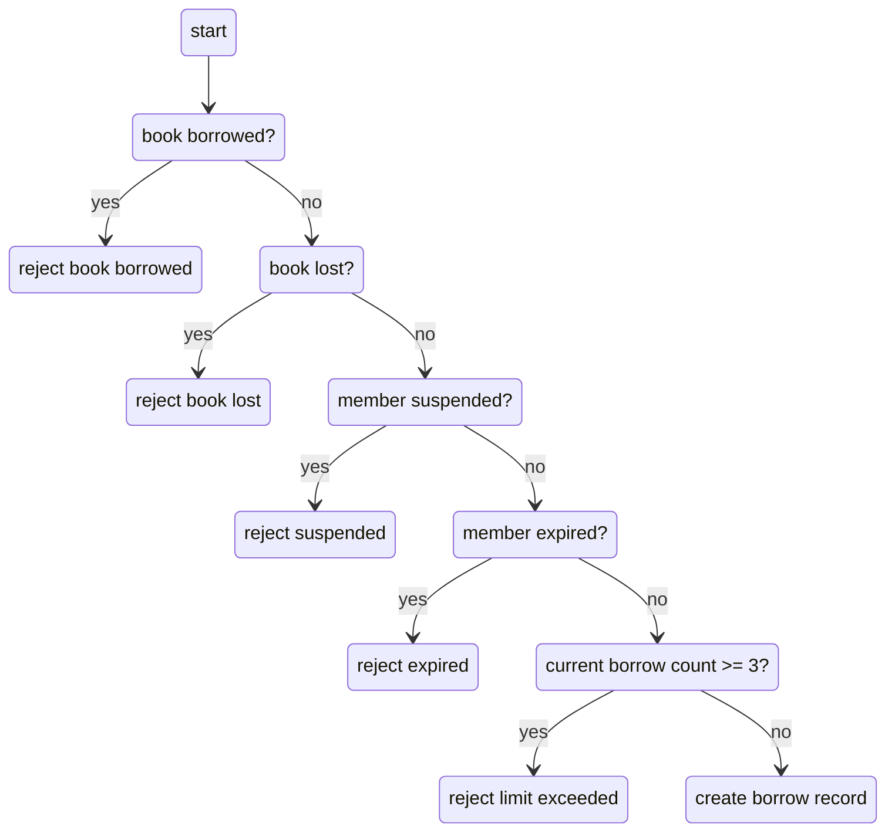

# Test Cases — Bảng trường hợp kiểm thử

> **Hướng dẫn**: Viết tối thiểu **20 TC** phủ đủ các chức năng chính (REQ-01 → REQ-08).
> Xem [examples/sample-test-case.md](../examples/sample-test-case.md) để hiểu cách viết TC tốt.
> Tự tổ chức và phân nhóm test case theo cách hợp lý nhất.

| Thông tin | |
|---|---|
| **Nhóm** | `Group 14` |
| **Ngày tạo** | `<!-- DD/MM/YYYY -->` |
| **Hệ thống** | https://stqa.rbc.vn |
| **Tham chiếu** | SRS v1.0 |

---

## Bước 1: Mô hình hóa miền đầu vào — Input Domain Modeling (IDM)

> 📖 **Textbook:** Chương 6 — *Input Domain Modeling*, Paul Ammann & Jeff Offutt.
>
> **Trước khi viết Test Case**, nhóm **phải** phân tích miền đầu vào bằng bảng IDM bên dưới.
> Mỗi chức năng cần xác định: **Đặc tính (Characteristic)**, **Phân vùng (Block/Partition)**, và **Giá trị đại diện (Value)**.

### IDM — Đăng nhập (REQ-01)

| Đặc tính (Characteristic) | Phân vùng (Block) | Giá trị đại diện (Value) | Kết quả mong đợi |
|---|---|---|---|
| Email có tồn tại trong DB? | Có | `librarian@library.com` | Đăng nhập thành công |
| | Không | `noone@email.com` | Thông báo lỗi |
| Mật khẩu có đúng? | Đúng | `admin123` | Đăng nhập thành công |
| | Sai | `wrongpass` | Thông báo lỗi |
| Ô nhập có rỗng? | Không rỗng | (giá trị bất kỳ) | Xử lý bình thường |
| | Rỗng | `""` | Thông báo "Vui lòng nhập..." |

### IDM — Tìm kiếm sách (REQ-03)

| Đặc tính (Characteristic) | Phân vùng (Block) | Giá trị đại diện (Value) | Kết quả mong đợi |
|---|---|---|---|
| Từ khóa có tồn tại trong DB? | Có (tên sách) | `"Flutter"` | Hiển thị sách chứa "Flutter" |
| | Có (tên tác giả) | `"Nguyễn"` | Hiển thị sách của tác giả Nguyễn |
| | Không | `"XYZ123"` | Danh sách rỗng |
| Phân biệt HOA/thường? | Chữ thường | `"flutter"` | Kết quả giống "Flutter" |
| | Chữ HOA | `"FLUTTER"` | Kết quả giống "Flutter" |

### IDM — Mượn sách (REQ-04, REQ-05)

| Đặc tính (Characteristic) | Phân vùng (Block) | Giá trị đại diện (Value) | Kết quả mong đợi |
|---|---|---|---|
| Trạng thái sách? | Có sẵn | BOOK001 | Cho phép mượn |
| | Đang mượn | BOOK003 | Không cho phép |
| | Thất lạc | BOOK007 | Không cho phép |
| Trạng thái thành viên? | Hoạt động | MEM002 | Cho phép mượn |
| | Tạm ngưng | MEM004 | Từ chối, thông báo lỗi |
| | Hết hạn | MEM005 | Từ chối, thông báo lỗi |
| Số sách đang mượn? | < 3 (BVA: 0, 1, 2) | MEM002 (1 sách) | Cho phép mượn |
| | = 3 (BVA: giới hạn) | MEM đã mượn 3 sách | Từ chối, thông báo vượt giới hạn |
| | > 3 | MEM has borrowed more than 3 books | Deny, announce limit exceeded |
### IDM — `<!-- Nhóm tự bổ sung cho REQ-05 đến REQ-08 -->`

| Đặc tính (Characteristic) | Phân vùng (Block) | Giá trị đại diện (Value) | Kết quả mong đợi |
|---|---|---|---|
| `<!-- Nhóm tự điền -->` | | | |

> 💡 **Gợi ý kỹ thuật**: Sử dụng **Phân lớp tương đương (EP)** cho các phân vùng rời rạc, **Phân tích giá trị biên (BVA)** cho các phân vùng số (ví dụ: giới hạn 3 sách). Xem textbook §6.1–6.3.
### Explanation of techniques used:
**1. Equivalence partition (EP):**

We use mathematical notions to construct our IDM: partitions and equivalence classes.

For each input, we define characteristics for it. These characteristics are defined such that they are partitions of the input set: that is, they are complete and disjoint.
Within a characteristic, we define equivalence classes, which are also known as blocks. As its name suggests, an equivalence class contains elements which are equivalent to each other. This means that we can pick whatever element (a representative value) in a class and the outcome of the test should still be the same, because they are all equivalent.

**2. Boundary value analysis (BVA):**

Boundary values are values where two equivalence classes "touch" each other. They appear in numerical equivalence classes, e.g. those in the "Number of current borrowed books" characteristic. These boundary values are usually the "critical points" - that is, bugs often appear here, so we need to pay more attention to them.

**3.  Base choice coverage (BCC) and prime path coverage (PPC):**

Prime path coverage: our prime paths are:
Happy path
[start, book borrowed?, reject book borrowed]
[start, book borrowed?, book lost?, reject book lost]
[start, book borrowed?, book lost?, member suspended?, reject suspended]
[start, book borrowed?, book lost?, member suspended?, member expired?, reject expired]
[start, book borrowed?, book lost?, member suspended?, member expired?, current borrow count >= 3?, reject limit exceeded]

Our test requirement will contain these paths.

Base choice coverage: we use BCC as our strategy to combine values from equivalence classes of characteristics. Our base choice is the happy path, hence there will be 6 test cases in total.

P/S: We actually proposed 7 test cases, the last one is dedicated to pinpoint the bug: the condition for checking borrow count is probably "> 3", not ">= 3".

**4. Decision table**
We do not include our last test case into the table as it is not a direct result of using BCC, as explained above.

| Test | Book not borrowed? | Book not lost? | Member not suspended? | Member not expired? | Borrow count < 3? | Predicate |
| ---- | ------------------ | -------------- | --------------------- | ------------------- | ----------------- | --------- |
| TC-04-01 | T | T | T | T | T | T |
| TC-04-02 | F | T | T | T | T | F |
| TC-04-03 | T | F | T | T | T | F |
| TC-04-04 | T | T | F | T | T | F |
| TC-04-05 | T | T | T | F | T | F |
| TC-04-06 | T | T | T | T | F | F |

This set of test cases satisfies the restricted active clause coverage (RACC) and also correlated ACC (CACC). We can choose any clause as the major clause, and:
- The major clause evaluates to T and F
- Predicate evaluates to T and F
- Minor clauses stay the same (this is not necessary for CACC)

For example, if we choose "Book not borrowed?" as the major clause, then we have the pair (TC-04-01, TC-04-02) which satisfies the conditions above; or for "Member not suspended?", we have the pair (TC-04-01, TC-04-04), etc.

---

## Bước 2: Test Cases

<!-- Tự tổ chức bảng test case: có thể chia nhóm theo chức năng, theo REQ, hoặc theo luồng nghiệp vụ — tùy nhóm quyết định. -->
<!-- Mỗi TC phải ánh xạ ngược về ít nhất 1 dòng trong bảng IDM ở Bước 1. -->

| Mã TC | Mục tiêu kiểm thử | Tiền điều kiện | Bước thực hiện | Dữ liệu đầu vào | Kết quả mong đợi | REQ | Kỹ thuật |
|-------|-------------------|---------------|---------------|-----------------|------------------|-----|---------|
| TC-04-01 | An active member whose borrow count is less than 3 borrows an available book | 1. Member can log in 2. Member is active 3. Book is available 4. Member's borrow count is less than 3 5. Display language: Vietnamese/English | 1. Refresh the page 2. Log in to the account of MEM002 3. Borrow the book BOOK001 | 1. Login email: ba.nguyen@email.com 2. Login password: password123 3. Book borrowed: BOOK001 | - Member can borrow the book - Display a successful message and the book is borrowed in corresponding display language - A borrow record for that member and that book is created, due date is 14 days later after today | REQ-04 | EP, BCC, PPC, RACC |
| TC-04-02 | An active member whose borrow count is less than 3 borrows a borrowed book | 1. Member can log in 2. Member is active 3. Book is borrowed 4. Member's borrow count is less than 3 5. Display language: Vietnamese/English | 1. Refresh the page 2. Log in to the account of MEM002 3. Borrow the book BOOK013 | 1. Login email: ba.nguyen@email.com 2. Login password: password123 3. Book borrowed: BOOK013 | - Member cannot borrow the book - Display the book is borrowed in corresponding display language - Program state remains unchanged | REQ-04 | EP, BCC, PPC, RACC |
| TC-04-03 | An active member whose borrow count is less than 3 borrows a lost book | 1. Member can log in 2. Member is active 3. Book is lost 4. Member's borrow count is less than 3 5. Display language: Vietnamese/English | 1. Refresh the page 2. Log in to the account of MEM002 3. Borrow the book BOOK013 | 1. Login email: ba.nguyen@email.com 2. Login password: password123 3. Book borrowed: BOOK013 | - Member cannot borrow the book - Display the book is lost in corresponding display language - Program state remains unchanged | REQ-04 | EP, BCC, PPC, RACC |
| TC-04-04 | A suspended member whose borrow count is less than 3 borrows an available book | 1. Member can log in 2. Member has been suspended 3. Book is available 4. Member's borrow count is less than 3 5. Display language: Vietnamese/English | 1. Refresh the page 2. Log in to the account of MEM004 3. Borrow the book BOOK001 | 1. Login email: cu.le@email.com 2. Login password: password123 3. Book borrowed: BOOK001 | - Member cannot borrow the book - Display error message in corresponding display language: member has been suspended - Program state remains unchanged | REQ-04 | EP, BCC, PPC, RACC |
| TC-04-05 | An expired member whose borrow count is less than 3 borrows an available book | 1. Member can log in 2. Member has expired 3. Book is available 4. Member's borrow count is less than 3 5. Display language: Vietnamese/English | 1. Refresh the page 2. Log in to the account of MEM005 3. Borrow the book BOOK001 | 1. Login email: binh.pham@email.com 2. Login password: password123 3. Book borrowed: BOOK001 | - Member cannot borrow the book - Display error message in corresponding display language: member has expired - Program state remains unchanged | REQ-04 | EP, BCC, PPC, RACC |
| TC-04-06 | An active member whose borrow count is 3 borrows an available book | 1. Member can log in 2. Member is active 3. Book is available 4. Member's borrow count is 3 5. Display language: Vietnamese/English | 1. Refresh the page 2. Log in to the account of MEM002 3. Borrow the book BOOK001 4. Borrow the book BOOK002 5. Borrow the book BOOK005 | 1. Login email: ba.nguyen@email.com 2. Login password: password123 3. Books borrowed: BOOK001, BOOK002, BOOK005 | - Member cannot borrow the book BOOK005 - BOOK005 remains available - Display error message when borrowing BOOK005 in corresponding display language: borrow limit reached - Borrow records for that member and books BOOK001 and BOOK002 are created, due date is 14 days later after today, no record created for BOOK005 | REQ-04 | EP, BCC, PPC, RACC |

---

## Tổng hợp

| Nhóm chức năng | Số TC | REQ phủ | Kỹ thuật IDM áp dụng |
|----------------|-------|---------|----------------------|
| Borrow Book | 6 | REQ-04 | EP |
| **Tổng** | **<!-- ≥ 20 -->** | | |

