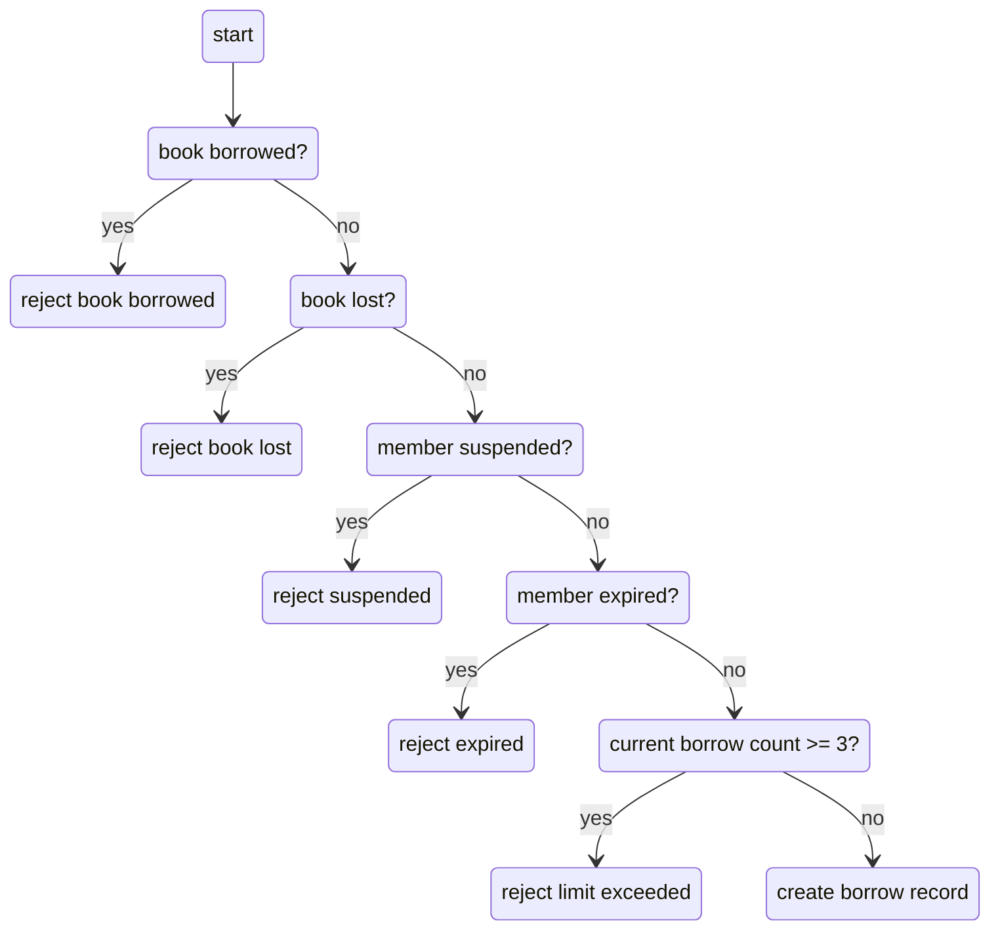

# Test Cases — Bảng trường hợp kiểm thử

> **Hướng dẫn**: Viết tối thiểu **20 TC** phủ đủ các chức năng chính (REQ-01 → REQ-08).
> Xem [examples/sample-test-case.md](../examples/sample-test-case.md) để hiểu cách viết TC tốt.
> Tự tổ chức và phân nhóm test case theo cách hợp lý nhất.

| Thông tin | |
|---|---|
| **Nhóm** | Group 14 |
| **Ngày tạo** | 19/05/2026 |
| **Hệ thống** | https://stqa.rbc.vn |
| **Tham chiếu** | SRS v1.0 |

---

## Bước 1: Mô hình hóa miền đầu vào — Input Domain Modeling (IDM)

> 📖 **Textbook:** Chương 6 — *Input Domain Modeling*, Paul Ammann & Jeff Offutt.
>
> **Trước khi viết Test Case**, nhóm **phải** phân tích miền đầu vào bằng bảng IDM bên dưới.
> Mỗi chức năng cần xác định: **Đặc tính (Characteristic)**, **Phân vùng (Block/Partition)**, và **Giá trị đại diện (Value)**.

### IDM — Login (REQ-01)

| Characteristic | Block | Representative Value | Expected Result |
|---|---|---|---|
| Existing Email | Valid librarian account | librarian@library.com | Login successful |
|  | Valid member account | ba.nguyen@email.com | Login successful |
|  | Non-existing email | khongtontai@gmail.com | Display message: “Member not found” |
| Password | Correct password | admin123 | User can log in successfully |
|  | Incorrect password | wrongpassword123 | Display message: “Incorrect password” |
| Input Fields | Both fields filled | Valid email + valid password | Continue login process |
|  | Both fields empty | Email: ""   Password: "" | Display message: “Please enter email and password” |
| Validation Behavior | Empty email only | Email: ""   Password: password123 |Display message: "Please enter email" |
|  | Empty password only | Email: ba.nguyen@email.com   Password: "" |Display message: "Please enter password" |
| Email Format  | Valid email format | ba.nguyen@email.com | Continue login validation |
| |Invalid email format(missing . in the format)|user@gmail| Display message: "Member not found"
| |Invalid email format(missing @ in the format)|abc.com| Display message: "Member not found "

### IDM - View Book List (REQ-02)

| Characteristic | Block | Representative Value | Expected Result |
|---|---|---|---|
| User Role | Librarian | librarian@library.com | System displays complete book list |
|  | Member | ba.nguyen@email.com | System displays complete book list |
| Book Information Display | Complete book information | BOOK001 | System displays all 20 books: title, author, genre, published year correctly |
| Book Status | Available | BOOK001 | Status displayed as “Available” |
|  | Borrowed | BOOK003 | Status displayed as “Borrowed” |
|  | Lost | BOOK007 | Status displayed as “Lost” |
| Real-time Update | After borrowing a book | BOOK001 | Status changes immediately to “Borrowed” |
|  | After returning a book | BOOK003 | Status changes immediately to “Available” |

### IDM — Search & Filter Books (REQ-03)

| Characteristic | Block | Representative Value | Expected Result |
|---|---|---|---|
| Keywords exists in DB | Yes (book title) | `"Flutter"` | Display books containing "Flutter" |
| | Yes (author name) | `"Nguyễn Minh Đức"` | Display books by Nguyễn Minh Đức |
| | Books (category) | `"Công nghệ"` | Display 8 books in Technology category only |
| | No match | `"XYZ123"` | Display "Không tìm thấy sách" |
| | Completely empty search | no input | Display all 20 books |
| Case sensitivity | Mixed case - keyword bar | `"Nguyễn Minh Đức"` | Display correct result (baseline) |
| | category bar | `"Công nghệ"` | Display correct result (baseline) |
| | Lowercase - keyword bar | `"nguyễn minh đức"` | Same result as "Flutter" |
| | category bar | `"công nghệ"` | Same result as "Công nghệ" |
| | Uppercase - keyword bar| `"NGUYỄN MINH ĐỨC"` | Same result as "Flutter" |
| | category bar | `"CÔNG NGHỆ"` | Same result as "Công nghệ" |
| Diacritic sensitivity | No diacritics - keyword bar | `"Nguyen Minh Duc"` | Show all books by author matching "Nguyen Minh Duc" (SRS does not require) |
| | category bar | `"Cong nghe"` | Show all books with genre matching "Cong nghe" (SRS does not require) |
| Partial keyword | Partial input - keyword bar | `"Nguyễn"` | Display all books whose author contains "Nguyễn" (SRS does not specify) |
| | category bar | `"Công"` | Display all books whose genre contains "Công" (SRS does not specify) |
| Keyword + category combined | Both match | `"Nguyễn Minh Đức"` + `"Công nghệ"` | Display 2 books: BOOK008, BOOK011 |
| | Keyword and category mismatch| `"Nguyễn Minh Đức"` + `"Kinh tế"` | Display "No books found" |

### IDM — Borrow book (REQ-04)

| Characteristic | Block | Representative Value | Expected Result |
|---|---|---|---|
| Book status | Available | BOOK001 | Allow |
| | Borrowed | BOOK003 | Reject |
| | Lost | BOOK007 | Reject |
| Member status | Active | MEM002 | Allow |
| | Suspended | MEM004 | Reject, display error message |
| | Expired | MEM005 | Reject, display error message |
| Number of borrowed books | < 3 (BVA: 0, 1, 2) | MEM002 (1 book) | Allow |
| | = 3 (BVA: boundary) | MEM has borrowed 3 books | Reject, announce limit exceeded |
| | > 3 | MEM has borrowed more than 3 books | Reject, announce limit exceeded |

### IDM — Return Book (REQ-05)

| Characteristic | Block | Representative Value | Expected Result |
|---|---|---|---|
| Borrow record status | Borrowing (active) | `BR001` | Allow return process |
| | Returned | `BR004` | Return action is not allowed |
| Due date compared to current date | `currentDate < dueDate` | `10/09/2024 < 15/09/2024` | Return successfully without overdue warning |
| | `currentDate = dueDate` (Boundary) | `15/09/2024 = 15/09/2024` | Return successfully and display overdue warning |
| | `currentDate > dueDate` | `27/05/2026 > 15/09/2024` | Return successfully and display overdue warning |
| Record owner | Record belongs to the current member | `BR001` belongs to `MEM002` | `MEM002` can return the book |
| | Record does not belong to the current member | `BR001` belongs to `MEM002`, current user is `MEM003` | `MEM003` cannot view or return the book |

### IDM — Overdue Handling (REQ-06)

| Characteristic | Block | Representative Value | Expected Result |
|---|---|---|---|
| User role | Librarian | `librarian@library.com` | Can access **Check Overdue** function |
| | Member | `ba.nguyen@email.com` | Cannot access function |
| Due date compared to current date | `dueDate > currentDate` | `20/06 > 15/06` | Record is **not marked overdue** |
| | `dueDate = currentDate` (Boundary) | `15/06 = 15/06` | Record is marked **"Overdue"** |
| | `dueDate < currentDate` | `10/06 < 15/06` | Record is marked **"Overdue"** |
| Borrow record status | Borrowing | `Borrowing` | Eligible for overdue checking |
| | Returned | `Returned` | Not marked overdue / ignored |

### IDM — Members (REQ-07)

| Characteristic | Block | Representative Value | Expected Result |
|---|---|---|---|
| Username | Valid | "Kevin Hart" | Accept |
|  | Only spaces | "   " (3 spaces) | Reject, display "Please enter your username" |
|  | Blank | (blank) | Reject, display "Please enter your username" |
| Email | Valid | member@so.com | Accept |
|  | Missing @ or . | memberso.com or member@socom | Reject, display "Please enter your email" |
|  | Blank | (blank) | Reject, display "Please enter your email" |
| Phone number | x-digit number = 10 | 0988743321 | Accept |
|  | x-digit number != 10 | 09283189 | Reject, display "Please enter your phone number" |
|  | Contains letters | abcxyz | Reject, display "Please enter your phone number" |
|  | Not start with 0 | 9849927236 | Reject, display "Please enter your phone number" |
| Ability to add member | Admin | librarian@library.com | Allow add |
|  | Member | ba.nguyen@email.com | Not allowed |

### IDM — Search borrow tickets (REQ-08)

| Characteristic | Block | Representative Value | Expected Result |
|---|---|---|---|
| Role | Librarian | librarian@library.com | Display all tickets |
| | Member | ba.nguyen@email.com (MEM002) | Only display MEM002 tickets |
| Search member ID | Librarian search MEM002/MEM003/MEM006 | MEM002, MEM003, MEM006 | Display all corresponding tickets |
| | Member search self | MEM002 search MEM002 | Display borrow history of MEM002 |
| | Member search another | MEM002 search MEM003 | No tickets displayed, display "Not found" |
| | ID does not exist | MEM099 | Display "Not exist" or "Not found" |
| Borrow record ID | ID exists - Borrowed | BR001 | Display corresponding status |
| | ID exists - Returned | BR002 | Display "Returned" message |
| | ID exists - Expired | BR001 (after check overdue) | Display "Expired" message |
| | ID does not exist | BR369 | Display "Not found" |
| Borrow history | Has history | MEM002 has BR001, BR004 | Display borrow history |
| Borrow history | Never borrowed | New member | Empty list |

---

### Explanation of Techniques Used:

**1. Equivalence Partition (EP):**

We use mathematical notions to construct our IDM: partitions and equivalence classes.

For each input, we define characteristics for it. These characteristics are defined such that they are partitions of the input set: that is, they are complete and disjoint.
Within a characteristic, we define equivalence classes, which are also known as blocks. As its name suggests, an equivalence class contains elements which are equivalent to each other. This means that we can pick whatever element (a representative value) in a class and the outcome of the test should still be the same, because they are all equivalent.

We use EP because with EP, we do not need to test all possible inputs in the input space while still retaining the effectiveness of tests.

**2. Boundary Value Analysis (BVA):**

Boundary values are values where two equivalence classes "touch" each other. They appear in numerical equivalence classes, e.g. those in the "Number of current borrowed books" characteristic. These boundary values are usually the "critical points" - that is, bugs often appear here, hence that is why we used the BVA technique to design our test cases.

**3.  Base Choice Coverage (BCC) and Prime Path Coverage (PPC):**

BCC and PPC are used to construct the decision table. In this section, we use REQ-04 as an example to illustrate how we used BCC and PPC to create decision tables for our test cases.

Prime path coverage: our prime paths are: 
Happy path 
[start, book borrowed?, reject book borrowed] 
[start, book borrowed?, book lost?, reject book lost] 
[start, book borrowed?, book lost?, member suspended?, reject suspended] 
[start, book borrowed?, book lost?, member suspended?, member expired?, reject expired] 
[start, book borrowed?, book lost?, member suspended?, member expired?, current borrow count >= 3?, reject limit exceeded]

Our test requirement will contain these paths.

Base choice coverage: we use BCC as our strategy to combine values from equivalence classes of characteristics. Our base choice is the happy path, hence there will be 6 test cases in total.

P/S: Some REQs will have more test cases than what is illustrated in the decision table. BCC sometimes misses edge test cases, hence we have to include them independently.

**4. Decision Table**

Below is the decision table for REQ-04:

| Test | Book not borrowed? | Book not lost? | Member not suspended? | Member not expired? | Borrow count < 3? | Predicate |
| ---- | ------------------ | -------------- | --------------------- | ------------------- | ----------------- | --------- |
| TC-04-01 | T | T | T | T | T | T |
| TC-04-02 | F | T | T | T | T | F |
| TC-04-03 | T | F | T | T | T | F |
| TC-04-04 | T | T | F | T | T | F |
| TC-04-05 | T | T | T | F | T | F |
| TC-04-06 | T | T | T | T | F | F |

This set of test cases satisfies the restricted active clause coverage (RACC) and also correlated ACC (CACC). We can choose any clause as the major clause, and:
- The major clause evaluates to T and F
- Predicate evaluates to T and F
- Minor clauses stay the same (this is not necessary for CACC)

For example, if we choose "Book not borrowed?" as the major clause, then we have the pair (TC-04-01, TC-04-02) which satisfies the conditions above; or for "Member not suspended?", we have the pair (TC-04-01, TC-04-04), etc.

We used decision tables because:
- It makes BCC clearer when our base choice is the happy path
- It shows if RACC is possible or we have to use the less strict CACC or GACC

---

## Bước 2: Test Cases

## REQ-01: Login

| TC ID | Test Objective | Preconditions | Test Steps | Input Data | Expected Result | REQ | Technique |
|-------|-------------------|---------------|---------------|-----------------|------------------|-----|---------|
| TC-01-01 | Verify successful login with librarian account | User is on Login page and not logged in | 1. Open https://stqa.rbc.vn   2. Enter email   3. Enter password   4. Click “Login” | Email: librarian@library.com   Password: admin123 | User is redirected to Home page. AppBar displays role “LIBRARIAN” | REQ-01 | EP, Decision Table |
| TC-01-02 | Verify successful login with member account | User is on Login page and not logged in | 1. Open https://stqa.rbc.vn   2. Enter email   3. Enter password   4. Click “Login” | Email: ba.nguyen@email.com   Password: password123 | User is redirected to Home page. AppBar displays role “MEMBER” | REQ-01 | EP, Decision Table|
| TC-01-03 | Verify login with non-existing email | User is on Login page | 1. Open https://stqa.rbc.vn   2. Enter non-existing email   3. Enter password   4. Click “Login” | Email: khongtontai@gmail.com   Password: password123 | System displays message: “Member not found” | REQ-01 | EP, Decision Table |
| TC-01-04 | Verify login with incorrect password | User is on Login page | 1. Open https://stqa.rbc.vn   2. Enter valid email   3. Enter incorrect password   4. Click “Login” | Email: ba.nguyen@email.com   Password: wrongpassword123 | System displays message: “Incorrect password” | REQ-01 | EP, Decision Table |
| TC-01-05 | Verify login when both email and password are empty | User is on Login page | 1. Open https://stqa.rbc.vn   2. Leave Email empty   3. Leave Password empty   4. Click “Login” | Email: ""   Password: "" | System displays message: “Please enter email and password” | REQ-01 | EP, Decision Table |
| TC-01-06 | Verify system behavior when email field is empty | User is on Login page | 1. Open https://stqa.rbc.vn   2. Leave Email empty   3. Enter password   4. Click “Login” | Email: ""   Password: password123 | Requirement gap: SRS does not specify expected behavior when only email field is empty | REQ-01 | EP, Decision Table |
| TC-01-07 | Verify system behavior when password field is empty | User is on Login page | 1. Open https://stqa.rbc.vn   2. Enter email   3. Leave Password empty   4. Click “Login” | Email: ba.nguyen@email.com   Password: "" | Requirement gap: SRS does not specify expected behavior when only password field is empty | REQ-01 | EP, Decision Table |
| TC-01-08 | Verify system behavior for invalid email format(missing @) | User is on Login page | 1. Open https://stqa.rbc.vn   2. Enter invalid email format   3. Enter password   4. Click “Login” | Email: abc.com   Password: password123 | "Requirement gap: SRS does not specify expected behavior for invalid email format (missing @)" | REQ-01 | EP, Decision Table |
| TC-01-09 | Verify system behavior for invalid email format(missing .) | User is on Login page | 1. Open https://stqa.rbc.vn   2. Enter invalid email format   3. Enter password   4. Click “Login” | Email: user@gmail   Password: password123 | "Requirement gap: SRS does not specify expected behavior for invalid email format (missing .)" | REQ-01 | EP, Decision Table |

---

## REQ-02: View Book List

| TC ID | Test Objective | Preconditions | Test Steps | Input Data | Expected Result | REQ | Technique |
|-------|-------------------|---------------|---------------|-----------------|------------------|-----|---------|
| TC-02-01 | Verify librarian can view the complete book list | User is logged in as librarian | 1. Login as librarian   2. Navigate to the “Books” tab   3. Check displayed book list | Email: librarian@library.com   Password: admin123 | System displays all 20 books with title, author, genre, published year | REQ-02 | EP, Decision Table |
| TC-02-02 | Verify member can view the complete book list | User is logged in as member | 1. Login as member   2. Navigate to the “Books” tab   3. Check displayed book list | Email: ba.nguyen@email.com   Password: password123 | System displays all 20 books with title, author, genre, published year| REQ-02 | EP, Decision Table |
| TC-02-03 | Verify complete book information is displayed correctly | User is logged in and currently on the “Books” tab | 1. Login   2. Navigate to the “Books” tab   3. Check information of BOOK001 | BOOK001 | System correctly displays title, author, genre, published year for BOOK001 | REQ-02 | EP, Decision Table |
| TC-02-04 | Verify book status is displayed correctly | User is logged in and currently on the “Books” tab | 1. Login   2. Navigate to the “Books” tab   3. Check status of BOOK001 and BOOK003 | BOOK001, BOOK003 | BOOK001 status is displayed as “Available”. BOOK003 status is displayed as “Borrowed” | REQ-02 | EP, Decision Table |
| TC-02-05 | Verify real-time status update after borrowing a book | User is logged in as member. BOOK001 is currently “Available” | 1. Login as member   2. Navigate to the “Books” tab   3. Verify BOOK001 is “Available”   4. Borrow BOOK001   5. Return to the “Books” tab   6. Check BOOK001 status again | BOOK001 | BOOK001 status changes immediately from “Available” to “Borrowed” | REQ-02 | EP, Decision Table |
| TC-02-06 | Verify lost books are displayed with correct status | User is logged in and currently on the “Books” tab | 1. Login as member   2. Navigate to the “Books” tab   3. Locate BOOK007 and BOOK020 in the book list 4.Observe displayed status  |BOOK007,BOOK020 | BOOK007 and BOOK020 are displayed with status “Lost” | REQ-02 | EP, Decision Table |
| TC-02-07 | Verify real-time status update after returning a book | User is logged in as member. BOOK003 is currently “Borrowed” | 1. Login as member   2. Navigate to the “Books” tab   3. Verify BOOK003 is “Borrowed”   4. Return BOOK003   5. Return to the “Books” tab   6. Check BOOK003 status again | BOOK003 | BOOK003 status changes immediately from “Borrowed” to “Available” | REQ-02 | EP, Decision Table |

---

## REQ-03: Search & Filter Books

| TC ID | Test Objective | Preconditions | Test Steps | Input Data | Expected Result | REQ | Technique |
|-------|-------------------|---------------|---------------|-----------------|------------------|-----|---------|
| TC-03-01 | Search by valid book title | Logged in as `ba.nguyen@email.com`. On Books tab. | 1. Click on the title or author search bar. 2. Type `"Flutter"`. 3. Observe the book list. | Keyword: `"Flutter"` | Display books whose title contains 'Flutter'. No other books shown. | REQ-03 | EP, Decision Table |
| TC-03-02 | Search by valid author name (Baseline for case sensitivity test) | Similar to the above | 1. Click on the title or author search bar. 2. Type `"Nguyễn Minh Đức"`. 3. Observe the book list. | Keyword: `"Nguyễn Minh Đức"` | Display 2 books whose author is "Nguyễn Minh Đức". No other books shown. Used as baseline for TC-03-05. | REQ-03 | EP, Decision Table |
| TC-03-03 | Filter books by category (Baseline for case sensitivity test) | Similar to the above | 1. Click on the category filter. 2. Type `"Công nghệ"`. 3. Observe the book list. | Keyword: `"Công nghệ"` | Display 8 books from Technology category that include the word 'Công nghệ'. No other books shown. Used as baseline for TC-03-06. | REQ-03 | EP, Decision Table |
| TC-03-04 | Search with keyword that does not exist in DB | Similar to the above | 1. Click on each search bar. 2. Type `"XYZ123"`. 3. Observe the book list. | Keyword: `"XYZ123"` | Display message "Không tìm thấy sách"/"No books found". No books shown. | REQ-03 | EP, Decision Table |
| TC-03-05 | Name bar - lowercase & uppercase input (case-insensitive) | Similar to the above | 1. Go to the title or author search bar. 2. Type `"nguyễn minh đức"`. 3. Observe the book list. 4. Do it again with `"NGUYỄN MINH ĐỨC"`. | Keyword: `"nguyễn minh đức"` & `"NGUYỄN MINH ĐỨC"` | Display 2 books whose title or author is "Nguyễn Minh Đức". Same result as TC-03-02. SRS requires case-insensitive search. | REQ-03 | EP, Decision Table |
| TC-03-06 | Category bar - lowercase & uppercase input (case-insensitive) | Similar to the above | 1. Go to the category filter. 2. Type `"công nghệ"`. 3. Observe the book list. 4. Do it again with `"CÔNG NGHỆ"`. | Keyword: `"công nghệ"` & `"CÔNG NGHỆ"` |  Display 8 Technogy books whose category is "Công nghệ". Same result as TC-03-03. | REQ-03 | EP, Decision Table |
| TC-03-07 | Name bar - input without diacritics | Similar to the above | 1. Go to the title or author search bar. 2. Type `"Nguyen Minh Duc"`. 3. Observe the book list. | Keyword: `"Nguyen Minh Duc"` | Same result as TC-03-02. Observation: SRS does not require diacritic-insensitive search. Record actual result only. | REQ-03 | EP, Decision Table |
| TC-03-08 | Category bar - input without diacritics | Similar to the above | 1. Go to the category filter. 2. Type Type `"Cong nghe"`. 3. Observe the book list. | Keyword: `"Cong nghe"` | Same result as TC-03-03. Observation: SRS does not require diacritic-insensitive search. Record actual result only. | REQ-03 | EP, Decision Table |
| TC-03-09 | Name bar - partial keyword input | Similar to the above | 1. Go to the title or author search bar. 2. Type `"Nguyễn"`. 3. Observe the book list. | Keyword: `"Nguyễn"` | Display all books whose author name contains 'Nguyễn'. Observation: SRS does not specify partial match. | REQ-03 | EP, Decision Table |
| TC-03-10 | Category bar - partial keyword input | Similar to the above | 1. Go to the category filter. 2. Type `"Công"`. 3. Observe the book list. | Keyword: `"Công"` | Display all books whose category contains 'Công'. Observation: SRS does not specify partial match. | REQ-03 | EP, Decision Table |
| TC-03-11 | Both fields empty | Similar to the above | 1. Go to both search bars. 2. Leave search bar empty. 3. Do not select any category. 4. Observe the book list. | Search bar: empty. Category: none selected. | Display all 20 books. | REQ-03 | EP, BVA, Decision Table |
| TC-03-12 | Combined search - both keyword and category match | Similar to the above | 1. Go to both search bars. 2. Type `"Nguyễn Minh Đức"` in the title or author search bar. 3. Type `"Công nghệ"` in the category filter. 4. Observe the book list. 5. Clear and then repeat this process, but reverse steps 2 and 3. | Keyword: `"Nguyễn Minh Đức"`. Category: `"Công nghệ"`. | Display 2 books whose author is "Nguyễn Minh Đức" and category is "Công nghệ". | REQ-03 | EP, Decision Table |
| TC-03-13 | Combined search - keyword matches but category mismatches | Similar to the above | 1. Go to both search bars. 2. Type `"Nguyễn Minh Đức"` in the title or author search bar. 3. Type `"Kinh tế"` in the category filter. 4. Observe the book list. 5. Clear and then repeat this process, but reverse steps 2 and 3. | Keyword: `"Nguyễn Minh Đức"`. Category: `"Kinh tế"`. | Display message "Không tìm thấy sách"/"No books found". System must apply both filters simultaneously. | REQ-03 | EP, Decision Table |
| TC-03-14 | Category bar - English keyword input (bilingual support) | Logged in as `ba.nguyen@email.com`. On Books tab. Interface language set to English. | 1. Go to **Books** tab. 2. Switch interface language to English. 3. Click on the category filter bar. 4. Type `"Technology"`. 5. Observe the book list. | Category: `"Technology"` | Display 8 books in Technology category (Same result as TC-03-03) | REQ-03 | EP, Decision Table |
---

## REQ-04: Borrow book

| TC ID | Test Objective | Preconditions | Test Steps | Input Data | Expected Result | REQ | Technique |
|-------|-------------------|---------------|---------------|-----------------|------------------|-----|---------|
| TC-04-01 | Borrow an available book | 1. Member can log in 2. Member is active 3. Book is available 4. Member's borrow count is less than 3 5. Display language: Vietnamese/English | 1. Refresh the page 2. Log in to the account of MEM002 3. Borrow the book BOOK001 | 1. Login email: ba.nguyen@email.com 2. Login password: password123 3. Book borrowed: BOOK001 | - Member can borrow the book - Display a successful message and book status change to "Borrowed" in corresponding display language - A borrow record for that member and that book is created, due date is 14 days later after today | REQ-04 | EP, Decision Table |
| TC-04-02 | Borrow a borrowed book | 1. Member can log in 2. Member is active 3. Book is borrowed 4. Member's borrow count is less than 3 5. Display language: Vietnamese/English | 1. Refresh the page 2. Log in to the account of MEM002 3. Borrow the book BOOK013 | 1. Login email: ba.nguyen@email.com 2. Login password: password123 3. Book borrowed: BOOK013 | - Member cannot borrow the book - Display the book status is "Borrowed" in corresponding display language - Program state remains unchanged | REQ-04 | EP, Decision Table |
| TC-04-03 | Borrow a lost book | 1. Member can log in 2. Member is active 3. Book is lost 4. Member's borrow count is less than 3 5. Display language: Vietnamese/English | 1. Refresh the page 2. Log in to the account of MEM002 3. Borrow the book BOOK013 | 1. Login email: ba.nguyen@email.com 2. Login password: password123 3. Book borrowed: BOOK013 | - Member cannot borrow the book - Display the book status is "Lost" in corresponding display language - Program state remains unchanged | REQ-04 | EP, Decision Table |
| TC-04-04 | A suspended member whose borrow count is less than 3 borrows an available book | 1. Member can log in 2. Member has been suspended 3. Book is available 4. Member's borrow count is less than 3 5. Display language: Vietnamese/English | 1. Refresh the page 2. Log in to the account of MEM004 3. Borrow the book BOOK001 | 1. Login email: cu.le@email.com 2. Login password: password123 3. Book borrowed: BOOK001 | - Member cannot borrow the book - Display error message in corresponding display language: member has been suspended - Program state remains unchanged | REQ-04 | EP, Decision Table |
| TC-04-05 | An expired member whose borrow count is less than 3 borrows an available book | 1. Member can log in 2. Member has expired 3. Book is available 4. Member's borrow count is less than 3 5. Display language: Vietnamese/English | 1. Refresh the page 2. Log in to the account of MEM005 3. Borrow the book BOOK001 | 1. Login email: binh.pham@email.com 2. Login password: password123 3. Book borrowed: BOOK001 | - Member cannot borrow the book - Display error message in corresponding display language: member has expired - Program state remains unchanged | REQ-04 | EP, Decision Table |
| TC-04-06 | An active member whose borrow count is 3 borrows an available book | 1. Member can log in 2. Member is active 3. Book is available 4. Member's borrow count is 3 5. Display language: Vietnamese/English | 1. Refresh the page 2. Log in to the account of MEM002 3. Borrow the book BOOK001 4. Borrow the book BOOK002 5. Borrow the book BOOK005 | 1. Login email: ba.nguyen@email.com 2. Login password: password123 3. Books borrowed: BOOK001, BOOK002, BOOK005 | - Member cannot borrow the book BOOK005 - BOOK005 remains available - Display error message when borrowing BOOK005 in corresponding display language: borrow limit reached - Borrow records for that member and books BOOK001 and BOOK002 are created, due date is 14 days later after today, no record created for BOOK005 | REQ-04 | EP, BVA, Decision Table |

---

## REQ-05: Return Book

| TC ID | Test Objective | Preconditions | Test Steps | Input Data | Expected Result | REQ | Technique |
|-------|-------------------|---------------|---------------|-----------------|------------------|-----|---------|
| TC-05-01 | Return a currently borrowed, non-overdue book successfully | - Member has an active borrow record. - A borrow record exists with `currentDate < dueDate`. - The system date/time can be adjusted on the test machine. | 1. Set the system date to a date **before the record due date**. 2. Refresh the web page. 3. Log in as the member who owns the borrow record. 4. Open **Borrow / Return** page. 5. Select an active borrow record that is not overdue. 6. Click **Return Book**. 7. Confirm return action. 8. Open **Book List** and verify the book status. | Example record: `BR001`. `currentDate < dueDate`. Example: `10/09/2024 < 15/09/2024`. | - Book is returned successfully. - No overdue warning message is displayed. - Book status changes to **"Available"**. - Borrow record status changes to **"Returned"**. | REQ-05 | EP, BVA, Decision Table |
| TC-05-02 | Return a book on the due date (boundary case) | - Member has an active borrow record. - A borrow record exists with `currentDate = dueDate`. - The system date/time can be adjusted on the test machine. | 1. Set the system date to the **same date as the borrow record due date**. 2. Refresh the web page. 3. Log in as the member who owns the borrow record. 4. Open **Borrow / Return** page. 5. Select a borrow record due today. 6. Click **Return Book**. 7. Observe whether an overdue warning is displayed. | Example record: `BR001`. `currentDate = dueDate`. Example: `15/09/2024 = 15/09/2024`. | - Book is returned successfully. - System displays a clear overdue warning. - Book status changes to **"Available"**. - Borrow record status changes to **"Returned"**. | REQ-05 | BVA, Decision Table |
| TC-05-03 | Return an overdue book | - Member has an active borrow record. - A borrow record exists with `currentDate > dueDate`. - The system date/time can be adjusted on the test machine. | 1. Set the system date to a date **after the borrow record due date**. 2. Refresh the web page. 3. Log in as the member who owns the borrow record. 4. Open **Borrow / Return** page. 5. Select an overdue borrow record. 6. Click **Return Book**. 7. Observe whether an overdue warning is displayed. | Example record: `BR001`. `currentDate > dueDate`. Example: `27/05/2026 > 15/09/2024`. | - Book is returned successfully. - System displays a **clear overdue warning**. - Book status changes to **"Available"**. - Borrow record status changes to **"Returned"**. | REQ-05 | EP, BVA, Decision Table |
| TC-05-04 | Return a book that has already been returned | - Member has a borrow record that has already been returned. - Book status is **Available**. | 1. Log in as the member who owns the returned borrow record. 2. Open **Borrow / Return** page. 3. Select/view a borrow record with status **Returned**. 4. Check whether the return action is available. | Example record: `BR004`. `recordStatus = Returned`. | - The system does not allow returning the same book again. - The **Return Book** button is not displayed or cannot be used. - Borrow record status remains **"Returned"**. - Book status remains **"Available"**. | REQ-05 | EP, Decision Table |
| TC-05-05 | Verify that a member cannot return another member’s borrowed book | - Login as a member account. - Another member has an active borrow record. - The borrow record does not belong to the current logged-in member. | 1. Login as `dam.tran@email.com` / `MEM003`. 2. Open **Borrow / Return** page. 3. Search for or try to access records belonging to another member, e.g. `MEM002`. 4. Try to view or select `BR001`, which belongs to `MEM002`. 5. If the **Return Book** button is available, click **Return Book**. 6. Observe whether the system allows the action. | Current user: `MEM003`. Target record owner: `MEM002`. Target record: `BR001`. `recordOwner != currentUser`. | - The system must not allow `MEM003` to view or return `MEM002`’s borrow record. - The **Return Book** button must not be displayed or must be disabled for records that do not belong to the current member. - The borrow record status remains unchanged. - The book status remains unchanged. | REQ-05, REQ-08 | EP, Decision Table |

---

## REQ-06: Overdue Handling

| TC ID | Test Objective | Preconditions | Test Steps | Input Data | Expected Result | REQ | Technique |
|-------|-------------------|---------------|---------------|-----------------|------------------|-----|---------|
| TC-06-01 | Librarian can check overdue records | - Librarian account is logged in. - Borrow records exist in the system. | 1. Login as librarian. 2. Open **Borrow / Return** page. 3. Click **Check Overdue** button. 4. Observe displayed records. | `librarian@library.com` | - Librarian can access and use the **Check Overdue** function. - Overdue borrow records are displayed or updated after checking. | REQ-06 | EP, Decision Table |
| TC-06-02 | Check borrow record not overdue | - Librarian is logged in. - A borrow record exists with `dueDate > current date`. - The system date/time can be adjusted on the test machine. | 1. Set the system date to a date **before the record due date**. 2. Refresh the web page. 3. Login as librarian. 4. Open **Borrow / Return** page. 5. Click **Check Overdue** button. 6. Observe borrow record status. | `currentDate < dueDate`. Example: `10/09/2024 < 15/09/2024`. | - Borrow record is **not marked as "Overdue"**. - Status remains **"Borrowing"**. | REQ-06 | EP, BVA, Decision Table |
| TC-06-03 | Check borrow record due today (boundary case) | - Librarian is logged in. - A borrow record exists with `dueDate = current date`. - The system date/time can be adjusted on the test machine. | 1. Set the system date to the **same date as the borrow record due date**. 2. Refresh the web page. 3. Login as librarian. 4. Open **Borrow / Return** page. 5. Click **Check Overdue** button. 6. Observe borrow record status. | `currentDate = dueDate`. Example: `15/09/2024 = 15/09/2024`. | - Borrow record is marked as **"Overdue"**. - `dueDate <= currentDate` is considered overdue. | REQ-06 | BVA, Decision Table |
| TC-06-04 | Check overdue borrow record | - Librarian is logged in. - A borrow record exists with `dueDate < current date`. - The system date/time can be adjusted on the test machine. | 1. Set the system date to a date **after the record due date**. 2. Refresh the web page. 3. Login as librarian. 4. Open **Borrow / Return** page. 5. Click **Check Overdue** button. 6. Observe borrow record status. | `currentDate > dueDate`. Example: `20/09/2024 > 15/09/2024`. | - Borrow record is marked as **"Overdue"**. | REQ-06 | EP, BVA, Decision Table |
| TC-06-05 | Member cannot use Check Overdue function | - Member account is logged in. | 1. Login as a member account. 2. Open **Borrow / Return** page. 3. Check whether the **Check Overdue** function is available. 4. Try to access or use the function if possible. | `ba.nguyen@email.com` / `MEM002` | - Member cannot access or use the **Check Overdue** function. - The **Check Overdue** button is not displayed or cannot be used. - Member cannot mark records as **"Overdue"**. | REQ-06 | EP, Decision Table |

---

## REQ-07: Members

| TC ID | Test Objective | Preconditions | Test Steps | Input Data | Expected Result | REQ | Technique |
|-------|-------------------|---------------|---------------|-----------------|------------------|-----|---------|
| TC-07-01 | Add new valid member | Login with Librarian account | 1. Go to Members tab 2. Click "Add member" 3. Fill in information 4. Confirm | Username: Nguyen Van Test Email: newmember@test.com Phone: 0901234567 | Member is created successfully, appears in list | REQ-07 | EP, Decision Table |
| TC-07-02 | Add member with email missing dot in domain | Login as Librarian | 1. Go to Members 2. Click Add 3. Enter email user@domain 4. Confirm | Email: user@domain | System rejects, displays email error message | REQ-07 | BVA, Decision Table |
| TC-07-03 | Add member with email missing @ | Login as Librarian | 1. Go to Members 2. Click Add 3. Enter email userdomain.com 4. Confirm | Email: userdomain.com | System rejects, displays email error message | REQ-07 | BVA, Decision Table |
| TC-07-04 | Add member with duplicate email | Login as Librarian | 1. Go to Members 2. Click Add 3. Enter existing email (ba.nguyen@email.com) 4. Confirm | Email: ba.nguyen@email.com | System rejects, displays email already exists message | REQ-07 | EP, Decision Table |
| TC-07-05 | Check Member permission cannot see Members tab | Login with Member account (ba.nguyen) | 1. Login with MEM002 2. Observe displayed tabs | (no additional input needed) | "Members" tab does not appear or is not accessible | REQ-07 | EP, Decision Table |
| TC-07-06 | Shortest valid email (BVA) | Login as Librarian | 1. Go to Members 2. Click Add 3. Enter email a@b.co 4. Confirm | Email: a@b.co Phone: 0900000001 | Member is created successfully | REQ-07 | BVA, Decision Table |
| TC-07-07 | Add member with email having multiple @ or consecutive dots | Login as Librarian | 1. Click Add member 2. Enter email admin@@vn.com or admin@vn..com 3. Confirm | Email: admin@@vn.com / admin@vn..com | System rejects, displays email error message | REQ-07 | EP, Decision Table |
| TC-07-08 | Add member with blank username | Login as Librarian | 1. Click Add member 2. Leave Username blank 3. Confirm | Username: (blank), Email: admin@vn.com | System rejects, displays "Username blank" message | REQ-07 | EP, Decision Table |
| TC-07-09 | Phone number not start with 0 | Log in as Librarian | 1. Go to Members tab 2. Click "Add member" 3. Fill in information 4. Confirm | Username: Stranger, Email: admin@vn.com, Phone number: 9839219743 | System rejects, displays "Phone number invalid" message| REQ-07 | EP, Decision Table |
| TC-07-10 | Check all available members | Login with Librarian account | 1. Go to Members tab 2. View all categories: Active members, Suspened members, Expired members| (no additional input needed) | Librarian see all members appear in "Member" list | REQ-07 | EP, Decision Table |

---

## REQ-08: Search borrow tickets

| TC ID | Test Objective | Preconditions | Test Steps | Input Data | Expected Result | REQ | Technique |
|-------|-------------------|---------------|---------------|-----------------|------------------|-----|---------|
| TC-08-01 | Display borrow ticket list (Librarian) | Login as Librarian | 1. Login as Librarian 2. Go to Borrow/Return tab 3. Observe list | (no data input needed) | Display BR001–BR005 for all members | REQ-08 | EP, Decision Table |
| TC-08-02 | Display borrow ticket for Member (only theirs) | Login as MEM002 | 1. Login as MEM002 2. Go to Borrow/Return 3. Observe list | (MEM002) | Only see BR001 and BR004 (belonging to MEM002) | REQ-08 | EP, Decision Table |
| TC-08-03 | Search borrow ticket of another member (not allowed) | Login as MEM002 | 1. Login as MEM002 2. Go to Borrow/Return 3. Search for ID MEM003 | Search for MEM003 | Does not display MEM003 tickets; or displays "Not found" message | REQ-08 | EP, Decision Table |
| TC-08-04 | View details of ticket BR001 | Login as Librarian | 1. Login as Librarian 2. Go to Borrow/Return 3. Open BR001 | BR001 | Display complete: code, book, borrow date, return date, status | REQ-08 | EP, Decision Table |
| TC-08-05 | View ticket BR002 (returned) | Login as Librarian or MEM003 | 1. Login 2. Go to Borrow/Return 3. Open BR002 | BR002 (returned 20/08/2024) | Status displays "Returned" | REQ-08 | EP, Decision Table |
| TC-08-06 | Check overdue marking (Check Overdue) | Login as Librarian | 1. Login as Librarian 2. Click "Check Overdue" 3. Go to Borrow/Return, open BR001 | BR001 (expiry 15/09/2024) | BR001 status is changed to "Overdue" if expired | REQ-06, REQ-08 | EP, Decision Table |
| TC-08-07 | Check BR002 displays correct status after check overdue | Login as Librarian | 1. Login as Librarian 2. Check Overdue 3. Open BR002 | BR002 (returned) | BR002 still displays "Returned" | REQ-08 | EP, Decision Table |

---

## Summary

| Functional Group | TC Count | REQ Covered | IDM Technique Used |
|----------------|-------|---------|----------------------|
| Login | 9 | REQ-01 | EP, Decision Table |
| View Book List | 7 | REQ-02 | EP, Decision Table |
| Search & Filter Books | 14 | REQ-03 | EP, BVA, Decision Table |
| Borrow book | 6 | REQ-04 | EP, BVA, Decision Table |
| Return Book | 5 | REQ-05, REQ-08 | EP, BVA, Decision Table |
| Overdue Handling | 5 | REQ-06 | EP, BVA, Decision Table |
| Members | 10 | REQ-07 | EP, BVA, Decision Table |
| Search borrow tickets | 7 | REQ-08 | EP, Decision Table |
| **Total** | 63 | REQ-01 → REQ-08 | EP, BVA, Decision Table |
